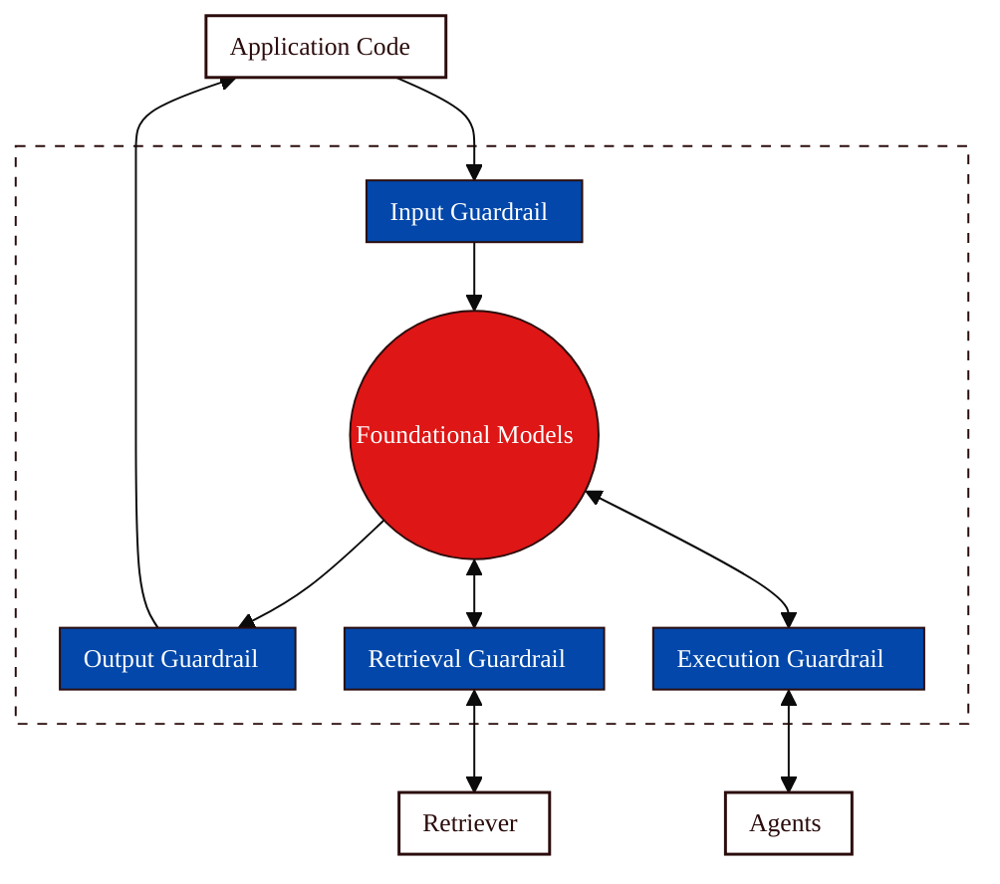
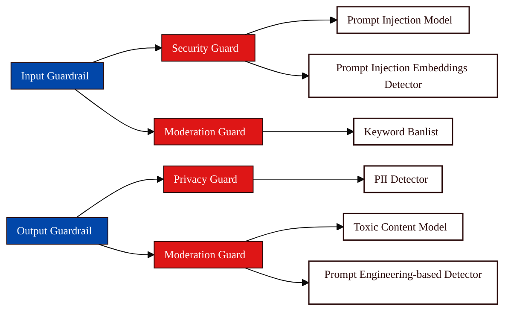

A Guardrail is a configured pipeline of [Guards](/concepts/defense/guard) that implements your protection policy. If Guards are the individual security checks, Guardrails are the security checkpoint they define which checks happen, in what order, and what to do with the results.

Vijil Dome allows users to assemble and configure Guardrails, which are designed to scan data exchanged with LLMs, knowledge bases, or other agents. Dome supports several types of Guardrails:

- **Input Guardrails**: For scanning inputs to a foundation model.
- **Output Guardrails**: For scanning outputs from a foundation model.
- **Retrieval Guardrails** (coming soon): To protect requests to and from retrievers.
- **Execution Guardrails** (coming soon): To protect requests to and from external agents and tools.

<Info>
The Vijil Console currently configures Input and Output Guards from the selected Agent's **Protect** view. Retrieval and Execution Guardrails are broader concepts and are not sections in the current Console.
</Info>



Guardrails consist of a set of [Guards](/concepts/defense/guard) and how they should be executed. These Guards are fully configurable and customizable.

## Setting Up Guards and Detectors

Users can configure Guards by selecting and combining different [Detectors](/concepts/evaluation-components/detector) based on their specific needs. This customization allows for flexible and robust Guardrails that cater to diverse application requirements.



### Example Configuration

Here is an example based on the predefined Console Guards and Detectors (see the [Configuring Dome section](/owner-guide/protect-in-production/configuring-guardrails) for more details):

<CodeGroup>
```python title="Python" icon="python"

 config = {
    ########################
    # Setup Guardrails from Guards
    ########################
    # Input Guardrail
    "input-guards": ["security-guard", "moderation-guard"],

    # Output Guardrail
    "output-guards": ["moderation-guard", "privacy-guard"],

    ##########################
    # Assemble and configure Guards
    ##########################

    # Security input Guard
    "security-guard": {
        "type": "security",
        "methods": ["encoding-heuristics", "prompt-injection-mbert"],
    },

    # Moderation input and output Guard
    "moderation-guard": {
        "type": "moderation",
        "methods": ["moderation-flashtext", "moderation-mbert"],
    },

    # Privacy output Guard
    "privacy-guard": {
        "type": "privacy",
        "methods": ["privacy-presidio"],
    },
}
```
</CodeGroup>

### Scan Results

The output from Dome's `scan` functions is a `ScanResult` object. It contains the following fields
- `flagged`: boolean value that indicates if the Guardrail has flagged the data that was passed through it. If this is true, it means the input is in violation of the policy the Guardrail aims to enforce. This value will always be the opposite of the value returned from the ScanResult's `.is_safe()` method.
- `response_string`: a string that contains the Guardrail's response message. This can be the original input if there was nothing wrong with it, a sanitized version of the input, or a message indicating that the input was blocked, along with the methods that blocked it.
- `exec_time`: float. the time it took for the Guardrail to scan the input, measured in milliseconds
- `trace`: a dictionary. This contains the execution information for every Guard in the Guardrail. This includes whether or not they were flagged, their individual execution times, and debugging information for each Detector in the Guard.

## Next Steps

<CardGroup cols={2}>
  <Card title="Guard" icon="shield" href="/concepts/defense/guard">
    Understand individual protection types
  </Card>
  <Card title="Detector" icon="microscope" href="/concepts/defense/detector">
    The detection engines inside Guards
  </Card>
  <Card title="Configure Guardrails" icon="sliders-horizontal" href="/owner-guide/protect-in-production/configuring-guardrails">
    Set up Dome for your agent
  </Card>
</CardGroup>
