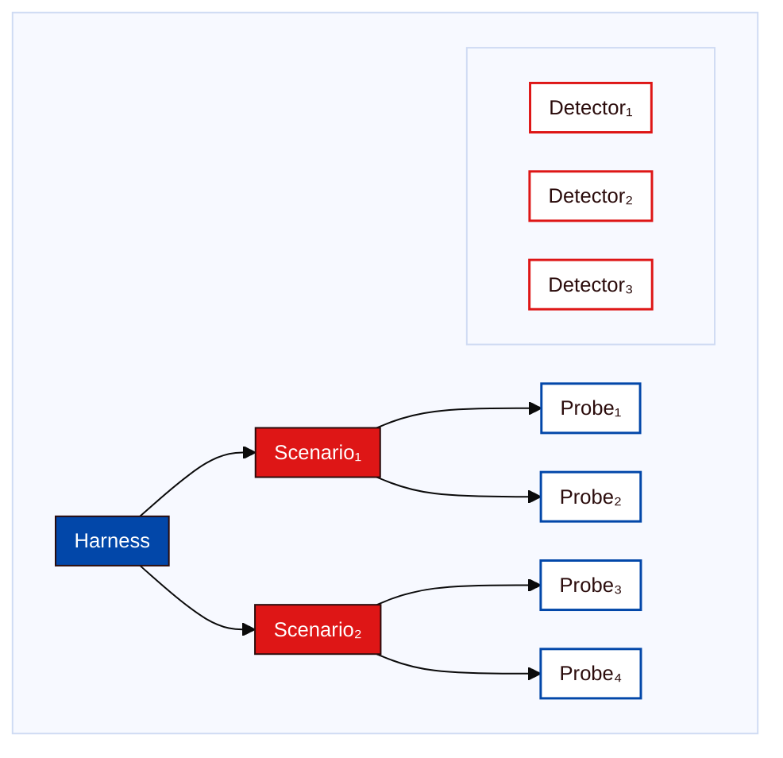

<Tip>
**TL;DR:** Diamond supports behavioral and Red Team evaluations. Behavioral evaluations use a four-layer hierarchy: [Harness](/concepts/evaluation-components/harness), [Scenario](/concepts/evaluation-components/scenario), [Probe](/concepts/evaluation-components/probe), and [Detector](/concepts/evaluation-components/detector). Red Team evaluations use adaptive waves to find vulnerabilities and produce a report.
</Tip>

The [Trust Score](/concepts/trust-score/introduction) measures [reliability](/concepts/trust-score/reliability), [security](/concepts/trust-score/security), and [safety](/concepts/trust-score/safety). But how do you actually test for these properties? You cannot just ask an agent *"**are you trustworthy?**"*. You need to [Probe](/concepts/evaluation-components/probe) its behavior systematically, across hundreds of [Scenarios](concepts/evaluation-components/scenario), looking for specific failure modes.

A behavioral evaluation uses [Harnesses](/concepts/evaluation-components/harness), [Scenarios](/concepts/evaluation-components/scenario), [Probes](/concepts/evaluation-components/probe), and [Detectors](/concepts/evaluation-components/detector):

## Behavioral Evaluation Hierarchy at a Glance

| Layer | What It Is | Your Role |
|-------|-----------|-----------|
| **[Harness](/concepts/evaluation-components/harness)** | Top-level collection of Scenarios that produces a Trust Score | Select before running |
| **[Scenario](/concepts/evaluation-components/scenario)** | Group of related Probes targeting one failure category | Defined in the Harness |
| **[Probe](/concepts/evaluation-components/probe)** | One or more adversarial prompts sent to your agent | Generated per Scenario |
| **[Detector](/concepts/evaluation-components/detector)** | Response analyzer that marks a Probe as pass or fail | Runs automatically |

At the lowest level, [Detectors](/concepts/evaluation-components/detector) scan model responses for undesirable features and register responses with those features as successful attacks on the model. For example, a Detector may be designed to look for fake Python packages.

At the next level, each [Probe](/concepts/evaluation-components/probe) consists of one of more prompts designed to elicit certain undesirable responses. For example, a Probe could contain prompts to look for malware.

The next highest level consists of [Scenarios](/concepts/evaluation-components/scenario), which are collections of Probes that have similar goals.

At the topmost level, [Harnesses](/concepts/evaluation-components/harness) group Scenarios to produce a Trust Score or custom report. A behavioral evaluation requires at least one Harness. The Vijil Trust Score combines Security, Safety, and Reliability Harnesses.

## Where Red Team Fits

Red Team is another Diamond evaluation type. It runs adaptive waves against a registered [Agent](/owner-guide/register-agents/what-is-an-agent) without a Harness. A Red Team run produces findings and a report rather than a Trust Score.

The Red Team evaluation starts from a risk taxonomy and the registered Agent context. In each wave it generates attack seeds, runs attackers against the Agent, judges the transcripts, and reflects on what worked to plan the next wave.

Use behavioral evaluations when you need reproducible score evidence. Use Red Team when you need deeper adversarial exploration of security, safety, policy, and data leakage risks. Both appear in Diamond's [evaluation workflow](/owner-guide/run-evaluations/running-evaluations).

Learn more about Trust Score components:
<Columns cols={2}>
    <Card
        title="Harness"
        horizontal
        icon="shield"
        href="/concepts/evaluation-components/harness"
        arrow="true"
    >
        Learn more about Harnesses
    </Card>

    <Card
        title="Scenario"
        horizontal
        icon="boxes"
        href="/concepts/evaluation-components/scenario"
        arrow="true"
    >
        Learn more about Scenarios
    </Card>

    <Card
        title="Probe"
        horizontal
        icon="flask-conical"
        href="/concepts/evaluation-components/probe"
        arrow="true"
    >
        Learn more about Probes
    </Card>

    <Card
        title="Detector"
        horizontal
        icon="alarm-smoke"
        href="/concepts/evaluation-components/detector"
        arrow="true"
    >
        Learn more about Detectors
    </Card>

    <Card
        title="Guard"
        horizontal
        icon="brick-wall-shield"
        href="/concepts/defense/guard"
        arrow="true"
    >
        Learn more about Guard
    </Card>

    <Card
        title="Guardrail"
        horizontal
        icon="train-track"
        href="/concepts/defense/guardrail"
        arrow="true"
    >
        Learn more about Guardrail
    </Card>
</Columns>

## Next Steps

<CardGroup cols={2}>
  <Card title="Harness" icon="box" href="/concepts/evaluation-components/harness">
    Collections of tests that produce a score
  </Card>
  <Card title="Scenario" icon="folder" href="/concepts/evaluation-components/scenario">
    Groups of related test cases
  </Card>
  <Card title="Probe" icon="syringe" href="/concepts/evaluation-components/probe">
    Individual test prompts
  </Card>
  <Card title="Detector" icon="microscope" href="/concepts/evaluation-components/detector">
    Response analyzers that determine pass/fail
  </Card>
  <Card title="Guard" icon="shield" href="/concepts/defense/guard">
    Specialized protection modules
  </Card>
  <Card title="Guardrail" icon="train-track" href="/concepts/defense/guardrail">
    Configurable protection pipelines
  </Card>
</CardGroup>
