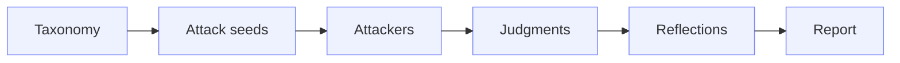

Diamond is Vijil’s evaluation engine - the part of the platform responsible for putting your Agent to the test before it ever reaches production.

Instead of relying on generic checks, Diamond actively challenges the Agent by sending **results from stress tests,** inputs that simulate real risks like prompt injection, unsafe requests, or edge-case failures. The goal is simply to expose weaknesses early, in a controlled environment.

Based on how the Agent responds, Diamond then produces a **Trust Score** that shows its overall readiness in three important areas: 

- Reliability 
- Security 
- Safety

## **Red Team in Diamond**

Diamond supports two complementary ways to evaluate an Agent:

| Mode | How It Works | Use It When |
|------|--------------|-------------|
| **Standard Evaluations** | Runs a structured [Harness](/concepts/evaluation-components/harness) made of [Scenarios](/concepts/evaluation-components/scenario), [Probes](/concepts/evaluation-components/probe), and [Detectors](/concepts/evaluation-components/detector). | You need a reproducible Trust Score, baseline readiness evidence, or a focused custom Harness, and produces a Trust Score. |
| **Red Team campaigns** | Runs an adaptive, multi-wave adversarial campaign against a registered [Agent](/owner-guide/register-agents/what-is-an-agent). Each wave generates attack seeds, launches attackers, judges transcripts, reflects on findings, and uses that feedback to plan the next wave. | You need deeper adversarial testing, want to uncover unknown vulnerabilities, or need evidence for security and risk review. |

Red Team uses the Agent context available in Diamond, including its purpose, policies, personas, tools, workflows, and known risks where available. Instead of sending a fixed set of Probes, it works through an iterative campaign:

The taxonomy defines the risk areas to explore. Attack seeds translate those risks into concrete goals. Attackers then run against the target Agent, judgments evaluate the transcripts, reflections identify what worked and what remains uncovered, and the final report clusters vulnerabilities, policy violations, leaked artifacts, and successful strategies.

## **The Trust Score**

At a high level, the Trust Score is a single, easy-to-understand number that answers to a particularly complicated question: _“Can this Agent be trusted in the real world?”_

Behind that number is a combination of structured testing and analysis, but what matters here is that it gives teams a clear signal. If an Agent is ready to move forward, or if it still needs more work.

### **Dimensions of Trust**

Observe the Trust Score as if it were built on three Dimensions:

- **Reliability**\
  Does the Agent constantly do what it is supposed to do? This includes handling tasks in a correct way, producing stable and predictable outputs.
- **Security**\
  Can the Agent handle malicious behavior effectively? This includes testing how well it responds to prompt injection, prevents data leaks, and resists attempts to manipulate or exploit the system. 
- **Safety**\
  Does the Agent stay within acceptable boundaries? This includes avoiding harmful content, respecting policies, and not taking any unauthorized actions.

Each of these Dimensions contributes to the final score and gives teams a clearer picture, so it is not just _if_ something is wrong, but _where_.

## **Evaluation Components**

To make sure that all of this works, Diamond organizes Evaluations into a structured hierarchy. You do not really need to think about it all the time, but it does help to understand how the system breaks things down:

**Harness → Scenario → Probe → Detector**

Each layer adds more details, going from high-level testing setups down to individual checks on Agent behavior.

### **Trust Score Components**

Here is how that hierarchy translates into an actual Evaluation process:

- **Harness**\
  This is the top-level setup for an Evaluation. What it does, is that defines the overall testing environment meaning what kind of Agent is being tested, under which conditions, and what are the goals in there.
- **Scenario**\
  Scenarios represent realistic situations which the Agent can encounter. For example, a customer support request, a malicious input, or a policy-sensitive interaction.
- **Probe**\
  Probes are the actual inputs sent to the Agent. These prompts are designed to test unusual or difficult Scenarios that help identify potential failures and reveal weaknesses in the system. 
- **Detector**\
  Detectors analyze the Agent’s responses. They check if something went wrong, for example a policy violation, a hallucination, or a security issue and then record the results.

If you want to create a short conclusion, it would be that these components allow Diamond to go beyond the superficial testing and find out how the Agent behaves under pressure.
