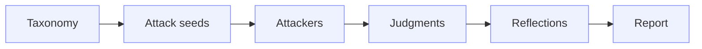

Diamond is Vijil’s evaluation engine - the part of the platform responsible for putting your Agent to the test before it ever reaches production.

In a behavioral evaluation, Diamond challenges the Agent with [Probes](/concepts/evaluation-components/probe) that simulate real risks like prompt injection, unsafe requests, or edge-case failures. The goal is to expose weaknesses early, in a controlled environment.

Based on how the Agent responds, a behavioral evaluation produces a **Trust Score** that shows its readiness in three areas:

- Reliability 
- Security 
- Safety

## **Red Team in Diamond**

Diamond supports two evaluation types for a registered Agent:

| Type | How It Works | Use It When |
|------|--------------|-------------|
| **Behavioral** (`behavioral`) | Runs a structured [Harness](/concepts/evaluation-components/harness) made of [Scenarios](/concepts/evaluation-components/scenario), [Probes](/concepts/evaluation-components/probe), and [Detectors](/concepts/evaluation-components/detector). Produces a Trust Score. | You need reproducible readiness evidence or a focused custom Harness. |
| **Red Team** (`redteam`) | Runs adaptive waves of adversarial attacks. Each wave generates seeds, launches attackers, judges transcripts, and uses reflections to plan the next wave. Produces findings and a report. | You need deeper security and safety testing or evidence of unknown vulnerabilities. |

Red Team uses the Agent context available in Diamond, including its purpose, policies, personas, tools, workflows, and known risks where available. Its adaptive campaign works through this loop:

```mermaid
---
config:
  layout: elk
---
flowchart LR
    Taxonomy[Taxonomy]
    AttackSeeds[Attack seeds]
    Attackers[Attackers]
    Judgments[Judgments]
    Reflections[Reflections]
    Report[Report]
    
    Taxonomy --> AttackSeeds
    AttackSeeds --> Attackers
    Attackers --> Judgments
    Judgments --> Reflections
    Reflections --> Report
    
    classDef box stroke:#818cf8,fill:#eef2ff
    class Taxonomy,AttackSeeds,Attackers,Judgments,Reflections,Report box
```

The taxonomy defines the risk areas to explore. Attack seeds translate those risks into concrete goals. Attackers then run against the target Agent, judgments evaluate the transcripts, reflections identify what worked and what remains uncovered, and the final report clusters vulnerabilities, policy violations, leaked artifacts, and successful strategies.

## **The Trust Score**

For behavioral evaluations, the Trust Score is a single, easy-to-understand number that answers a complicated question: _“Can this Agent be trusted in the real world?”_

Behind that number is a combination of structured testing and analysis, but what matters here is that it gives teams a clear signal. If an Agent is ready to move forward, or if it still needs more work.

### **Dimensions of Trust**

Observe the Trust Score as if it were built on three Dimensions:

- **Reliability**\
  Does the Agent constantly do what it is supposed to do? This includes handling tasks in a correct way, producing stable and predictable outputs.
- **Security**\
  Can the Agent handle malicious behavior effectively? This includes testing how well it responds to prompt injection, prevents data leaks, and resists attempts to manipulate or exploit the system. 
- **Safety**\
  Does the Agent stay within acceptable boundaries? This includes avoiding harmful content, respecting policies, and not taking any unauthorized actions.

Each of these Dimensions contributes to the final score and gives teams a clearer picture, so it is not just _if_ something is wrong, but _where_.

## **Evaluation Components**

For behavioral evaluations, Diamond organizes testing into a structured hierarchy:

**Harness → Scenario → Probe → Detector**

Each layer adds more details, going from high-level testing setups down to individual checks on Agent behavior.

### **Trust Score Components**

Here is how that hierarchy translates into a behavioral Evaluation process:

- **Harness**\
  This is the top-level setup for an Evaluation. What it does, is that defines the overall testing environment meaning what kind of Agent is being tested, under which conditions, and what are the goals in there.
- **Scenario**\
  Scenarios represent realistic situations which the Agent can encounter. For example, a customer support request, a malicious input, or a policy-sensitive interaction.
- **Probe**\
  Probes are the actual inputs sent to the Agent. These prompts are designed to test unusual or difficult Scenarios that help identify potential failures and reveal weaknesses in the system. 
- **Detector**\
  Detectors analyze the Agent’s responses. They check if something went wrong, for example a policy violation, a hallucination, or a security issue and then record the results.

If you want to create a short conclusion, it would be that these components allow Diamond to go beyond the superficial testing and find out how the Agent behaves under pressure.

## Explore Diamond

Pick the path that matches what you need to do next. Learn the ideas behind Diamond, run Evaluations from the Console, or integrate Diamond into your code.

### Understand the Concepts

<CardGroup cols={2}>
  <Card title="The Trust Score" icon="gauge" href="/concepts/trust-score/introduction">
    How Diamond scores Agent trustworthiness from 0 to 100.
  </Card>
  <Card title="How Evaluation Works" icon="workflow" href="/concepts/evaluation-components/introduction">
    The architecture behind systematic Agent testing.
  </Card>
  <Card title="Dimensions of Trust" icon="ruler-dimension-line" href="/concepts/trust-score/reliability">
    [Reliability](/concepts/trust-score/reliability), [Security](/concepts/trust-score/security), and [Safety](/concepts/trust-score/safety).
  </Card>
  <Card title="Evaluation Components" icon="handshake" href="/concepts/evaluation-components/harness">
    [Harness](/concepts/evaluation-components/harness), [Scenario](/concepts/evaluation-components/scenario), [Probe](/concepts/evaluation-components/probe), and [Detector](/concepts/evaluation-components/detector).
  </Card>
</CardGroup>

### Evaluate in the Console

<CardGroup cols={2}>
  <Card title="Build an Evaluation Environment" icon="sliders-vertical" href="/owner-guide/simulate-environment/personas">
    Define [Personas](/owner-guide/simulate-environment/personas), [Policies](/owner-guide/simulate-environment/policies), and [Harnesses](/owner-guide/simulate-environment/harnesses/trust-score).
  </Card>
  <Card title="Run Evaluations" icon="play" href="/owner-guide/run-evaluations/running-evaluations">
    Start an Evaluation on a registered Agent from the Console.
  </Card>
  <Card title="Understand Results" icon="chart-bar" href="/owner-guide/run-evaluations/understanding-results">
    Read Trust Scores and Red Team findings.
  </Card>
</CardGroup>

### Evaluate Programmatically

<CardGroup cols={2}>
  <Card title="Evaluation Overview" icon="book-open-text" href="/developer-guide/evaluate/overview">
    The programmatic evaluation workflow end to end.
  </Card>
  <Card title="Run Evaluations" icon="terminal" href="/developer-guide/evaluate/running-evaluations">
    Start Evaluations through the CLI, MCP, REST API, or Python SDK.
  </Card>
  <Card title="Custom Harnesses" icon="wrench" href="/developer-guide/evaluate/custom-harnesses">
    Create targeted Evaluations with your own Harnesses.
  </Card>
  <Card title="Cloud Provider Integrations" icon="cloud" href="/developer-guide/evaluate/cloud-providers">
    Evaluate Agents hosted on major cloud platforms.
  </Card>
</CardGroup>

### Red Team Evaluations

<CardGroup cols={2}>
  <Card title="Run a Red Team Evaluation" icon="crosshair" href="/developer-guide/cli/red-team">
    Launch and inspect Diamond's [adaptive adversarial evaluation](#red-team-in-diamond).
  </Card>
</CardGroup>
