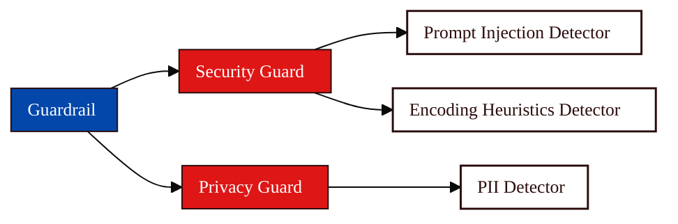

Instead of testing behavior in advance (like Diamond), Dome works in real time. It sits between the user and the [Agent](/owner-guide/register-agents/what-is-an-agent), intercepting both **inputs and outputs** as they happen. This allows Dome to filter harmful content, detect suspicious patterns, and strengthen policies without slowing things down (latency stays under ~300ms).

Dome protects Agents in two complementary ways:

- **Content Guards** intercept every input and output and block flagged content. This is the Guardrail → Guard → Detector model described below.
- The **[Trust Runtime](/concepts/defense/trust-runtime)** secures the Agent as an actor: it attests the Agent's identity, enforces which tools the Agent may call, and emits an audit trail. A single `secure_agent()` call applies both content Guards and tool-permission enforcement.

What makes Dome effective is its **multi-layer approach**. That means Dome does not rely on just one method, but combines these things:

- simple pattern matching
- machine learning classifiers
- embedding-based similarity checks
- and LLM-based evaluation

All of these components are working together just to catch different risks, whether they are some obvious types of policy violation or something that’s less obvious.

## Defense Components

Under the hood, Dome follows a clear hierarchy for how content protection is applied. A Guardrail contains one or more Guards, and each Guard runs one or more Detectors.

You do not need to configure everything from scratch, but understanding this hierarchy makes it easier to see how decisions are made and where controls are applied.

<CardGroup cols={3}>
<Card title="Guardrail" icon="train-track" href="/concepts/defense/guardrail">
Defines *what kind of behavior you want to control*, such as blocking sensitive data, preventing prompt injection, or enforcing content policies.
</Card>

<Card title="Guard" icon="shield" href="/concepts/defense/guard">
The building blocks inside a Guardrail. Each Guard focuses on a specific category, such as scanning for secrets, toxic language, or unusual patterns.
</Card>

<Card title="Detector" icon="microscope" href="/concepts/defense/detector">
The engines that evaluate the data. Detectors analyze inputs and outputs and decide whether something should be flagged, blocked, or modified.
</Card>
</CardGroup>