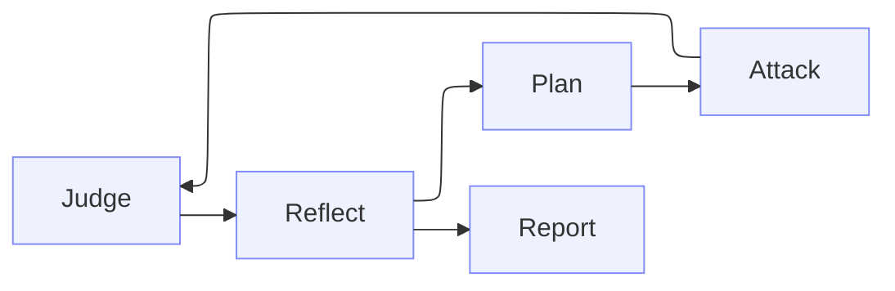

<Tip>
**TL;DR:** A Red Team run creates an **Engagement**: an adversarial agent that attacks your [Agent](/owner-guide/register-agents/what-is-an-agent) in **waves**, using what worked in one wave to plan the next. The result is Engagement evidence, not a [Trust Score](/concepts/trust-score/introduction).
</Tip>

Instead of sending a fixed set of [Probes](/concepts/evaluation-components/probe), an Engagement explores. It reads the context Vijil holds about the Agent, including its purpose, tools, workflows, [Policies](/owner-guide/simulate-environment/policies), and [Personas](/owner-guide/simulate-environment/personas), then works through a loop:

## The Wave Loop

A wave is one full iteration of that loop.

<Steps>
  <Step title="Plan">
    The Engagement picks risk areas that are not yet covered and turns each one into a seed: a concrete adversarial goal an attacker can pursue.
  </Step>
  <Step title="Attack">
    An attacker pursues each seed against the Agent across multiple turns, changing strategy when an attempt is refused.
  </Step>
  <Step title="Judge">
    A judge reads each full transcript and decides whether the Agent actually delivered harmful content.
  </Step>
  <Step title="Reflect">
    The Engagement summarizes which strategies worked and which risks remain, and that summary shapes the next wave.
  </Step>
</Steps>

Because reflections feed back into planning, coverage concentrates where the Agent is actually weak. An Engagement stops when it reaches its maximum wave count, or earlier if it has run its minimum waves and the target is degrading. Wave count, seeds per wave, and attacker concurrency are all configurable, since each wave costs time and money.

## What Shapes The Attacks

**The risk taxonomy** sets the ground to cover. Engagements default to a taxonomy based on the **OWASP Agentic Security Initiative** top ten risks for agentic systems, covering categories such as memory poisoning, tool misuse, privilege compromise, and cascading failures.

**The Agent's own context** makes each seed specific. A seed generated for a travel booking Agent that holds payment tools looks nothing like a seed for a documentation assistant, even when both come from the same taxonomy entry. Attaching Policies also lets the judge name a concrete policy violation rather than fall back on general safety and security expectations.

## What An Engagement Produces

| Artifact | What It Shows |
|----------|---------------|
| **Waves** | The seeds generated in each wave and the attacker runs against them, with full transcripts |
| **Judgments** | Per-attack verdicts on whether harmful content was delivered |
| **Reflections** | Per-wave analysis of what worked and what to try next |
| **Report** | Clustered vulnerabilities, policy violations, leaked artifacts, and successful strategies |

## Next Steps

<CardGroup cols={2}>
  <Card title="Run a Campaign" icon="play" href="/owner-guide/red-team/running-campaigns">
    Launch Red Team from the Console
  </Card>
  <Card title="Understand Results" icon="brain" href="/owner-guide/red-team/understanding-results">
    Read waves, judgments, and the final report
  </Card>
  <Card title="Run One Programmatically" icon="terminal" href="/developer-guide/red-team/overview">
    Create and inspect an Engagement from the CLI, MCP, or REST API
  </Card>
</CardGroup>
