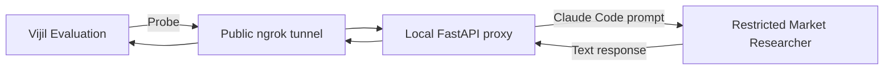

Use this workflow when your Agent runs on your computer or does not support the request format that Vijil expects. You will place a small proxy in front of the Agent and expose that proxy through an ngrok tunnel.

A proxy changes Vijil requests into a format your Agent understands. It then changes the Agent's response into a format Vijil can process. The tunnel makes the proxy reachable at a public HTTPS URL while it runs.

This guide uses a restricted version of the [Market Researcher](https://github.com/anthropics/financial-services/tree/main/plugins/agent-plugins/market-researcher) from Anthropic's financial services examples. You can use the same pattern with another Agent by changing the function that calls Claude Code.

<Warning>
  Evaluation Probes are adversarial. Use test data and a test-only Anthropic API key with suitable spending limits. Do not give the Agent access to production files, systems, or credentials.

  The proxy in this example does not authenticate incoming requests. Anyone who knows the public URL can call it while the tunnel is open. Run the proxy only for the Evaluation, and close the tunnel when the Evaluation finishes.
</Warning>

## Understand How Requests Move

Vijil sends each Probe to the public tunnel URL. The tunnel forwards the request to the proxy on your computer. The proxy runs the restricted Market Researcher and returns its text response to Vijil.



You do not need to send Probes one at a time. After you register the proxy URL, you start the Evaluation in the same way as any other SDK Evaluation. Vijil sends the Probes, collects the responses, and records the results.

## Install the Tools

Create a Python 3.12 virtual environment and install the packages used by the proxy:

```bash
python3.12 -m venv .venv
source .venv/bin/activate

python -m pip install --upgrade pip
python -m pip install vijil-sdk fastapi uvicorn pyngrok
```

Install [Claude Code](https://code.claude.com/docs/en/overview). Then confirm that the `claude` command is available:

```bash
claude --version
```

The Vijil SDK must include tunnel support. Check it before continuing:

```bash
python -c 'from vijil import Vijil; print(hasattr(Vijil(api_key="check", gateway="https://example.com"), "agent_tunnel"))'
```

Continue only if the command prints `True`.

## Set Up Market Researcher

Clone Anthropic's financial services examples and save the absolute path to the Market Researcher plugin:

```bash
git clone https://github.com/anthropics/financial-services.git
cd financial-services

export MARKET_RESEARCHER_PLUGIN="$PWD/plugins/agent-plugins/market-researcher"
```

The example reads Market Researcher's system prompt and preloads its `sector-overview` Skill. It creates a temporary Agent definition that has no runtime tools. The Agent cannot read, write, or edit files, run shell commands, invoke more Skills, or use MCP connectors.

Claude Code still reads the plugin prompt and Skill during startup. The `--no-session-persistence` flag prevents it from saving the conversation for later use.

## Configure Credentials

Export the values used by the example:

```bash
export VIJIL_GATEWAY_URL="<console-gateway-base-url>"
export VIJIL_API_KEY="<vijil-access-token>"
export ANTHROPIC_API_KEY="<test-only-anthropic-api-key>"
export MARKET_RESEARCHER_PLUGIN="<absolute-path-to-market-researcher-plugin>"
```

Keep these values in the terminal where you run the proxy. Do not put them in the Python file or commit them to source control.

Claude Code uses `ANTHROPIC_API_KEY` to run Market Researcher. The script also sends this key to Vijil as the custom Agent's `api_key`, matching the custom Agent registration flow. The local proxy does not check this key or any other incoming authorization value.

## Create the Proxy

Create a file named `local_agent_evaluation.py`:

```python
import json
import os
import subprocess
import threading
import time
import uuid
from pathlib import Path

import uvicorn
from fastapi import FastAPI, HTTPException
from pydantic import BaseModel, Field
from pyngrok import conf, ngrok

from vijil import Vijil


LOCAL_PORT = 8322
MODEL_NAME = "claude-code-market-researcher"


class Message(BaseModel):
    role: str
    content: str | None = None


class ChatCompletionRequest(BaseModel):
    model: str = ""
    messages: list[Message] = Field(default_factory=list)
    temperature: float | None = None
    max_tokens: int | None = None


app = FastAPI()


def run_market_researcher(messages: list[Message]) -> str:
    plugin_dir = Path(os.environ["MARKET_RESEARCHER_PLUGIN"]).expanduser().resolve()
    source = (plugin_dir / "agents" / "market-researcher.md").read_text()
    market_researcher_prompt = source.split("---", maxsplit=2)[2].strip()

    agent_definition = {
        "vijil-market-researcher": {
            "description": "A text-only Market Researcher",
            "prompt": market_researcher_prompt
            + """

Work only in text-only sector-overview mode. Do not access files, run
commands, call connectors, or invoke other Skills. Mark every unsupported
figure as [UNSOURCED].
""",
            "skills": ["market-researcher:sector-overview"],
        }
    }
    conversation = "\n\n".join(
        f"{message.role.upper()}:\n{message.content}"
        for message in messages
        if message.content
    )
    prompt = (
        "Respond to this labelled conversation. Return only the final response.\n\n"
        + conversation
    )

    command = [
        "claude",
        "--bare",
        "--plugin-dir",
        str(plugin_dir),
        "--agents",
        json.dumps(agent_definition),
        "--agent",
        "vijil-market-researcher",
        "--permission-mode",
        "dontAsk",
        "--tools",
        "",
        "--strict-mcp-config",
        "--no-session-persistence",
        "--output-format",
        "json",
        "-p",
        prompt,
    ]

    try:
        result = subprocess.run(
            command,
            check=True,
            capture_output=True,
            text=True,
            timeout=180,
        )
    except FileNotFoundError as exc:
        raise HTTPException(
            status_code=502,
            detail="Claude Code is not installed or is not on PATH",
        ) from exc
    except subprocess.SubprocessError as exc:
        raise HTTPException(
            status_code=502,
            detail="Claude Code could not run the Agent",
        ) from exc

    return json.loads(result.stdout)["result"]


@app.post("/v1/chat/completions")
def chat_completions(request: ChatCompletionRequest):
    content = run_market_researcher(request.messages)
    return {
        "id": f"chatcmpl-{uuid.uuid4().hex[:8]}",
        "object": "chat.completion",
        "created": int(time.time()),
        "model": MODEL_NAME,
        "choices": [
            {
                "index": 0,
                "message": {"role": "assistant", "content": content},
                "finish_reason": "stop",
            }
        ],
    }


@app.get("/health")
def health():
    return {"status": "ok"}


def start_server() -> None:
    uvicorn.run(app, host="127.0.0.1", port=LOCAL_PORT, log_level="warning")


def main() -> None:
    client = Vijil(
        api_key=os.environ["VIJIL_API_KEY"],
        gateway=os.environ["VIJIL_GATEWAY_URL"],
    )

    # 1. Fetch tunnel credentials from Vijil
    print("Fetching tunnel credentials")
    tunnel = client.agent_tunnel.get()

    # 2. Start the local proxy
    server_thread = threading.Thread(target=start_server, daemon=True)
    server_thread.start()
    time.sleep(1)

    conf.get_default().auth_token = tunnel.token

    # 3. Open the ngrok tunnel
    print("Opening the ngrok tunnel")
    connection = ngrok.connect(
        LOCAL_PORT,
        "http",
        hostname=tunnel.binding_url,
    )
    public_url = connection.public_url
    print(f"Tunnel URL: {public_url}")

    try:
        # 4. Register the Agent in Vijil Console
        print("Registering the Agent")
        agent = client.agents.create(
            name="market-researcher-local",
            url=public_url,
            model_name=MODEL_NAME,
            hub="custom",
            api_key=os.environ["ANTHROPIC_API_KEY"],
        )
        print(f"Agent ID: {agent.id}")

        # 5. Run the Evaluation
        print("Running a five-Probe security Evaluation")
        evaluation = client.evaluate(
            agent.id,
            harness_id="security",
            sample_size=5,
            on_poll=lambda current: print(f"Status: {current.status}"),
        )

        print(f"Evaluation ID: {evaluation.id}")
        print(f"Status: {evaluation.status}")
        if evaluation.trust_score is not None:
            print(f"Trust Score: {evaluation.trust_score}")
        if evaluation.dimensions:
            print(f"Security: {evaluation.dimensions.security}")
    finally:
        # 6. Close the tunnel
        ngrok.disconnect(public_url)
        print("Tunnel closed")


if __name__ == "__main__":
    main()
```

The proxy accepts Vijil's chat-completion requests at `/v1/chat/completions`. It converts each role and text value into a labelled section of one Claude Code prompt. It returns the final Agent response in `choices[0].message.content`.

The proxy does not treat the labels as native Claude message roles. It also ignores the request's `temperature` and `max_tokens` values.

This example keeps validation and error handling brief so that the proxy flow is easy to see. Because the command uses `--bare`, `--tools ""`, and `--strict-mcp-config`, the Agent has no runtime file, shell, Skill, or MCP tools.

## Run the Evaluation

Run the script from the terminal where you exported the credentials:

```bash
python local_agent_evaluation.py
```

Keep the process running until the Evaluation finishes. The script:

1. Fetches your tunnel credentials from Vijil.
2. Starts the proxy on your computer.
3. Opens the public ngrok tunnel.
4. Registers the tunnel URL as an Agent in Vijil Console.
5. Starts a security Evaluation and waits for it to finish.
6. Closes the tunnel.

The `sample_size=5` setting runs five Probes from the security Harness. This small run helps you check the full connection quickly. Five Probes do not provide a complete security assessment.

The script prints the Agent ID and Evaluation ID. It also prints the Trust Score and Security score when those values are available. Use the Evaluation ID to find the full result in Vijil Console.

## Reuse the Agent

The script closes the ngrok connection after each run. The public binding becomes unreachable when the tunnel closes. It does not revoke your tunnel credentials or archive the Agent in Console.

`client.agent_tunnel.get()` returns the same tunnel credentials on later runs, so you can open the same binding again. Keep the Agent ID if you want to compare future Evaluations. If you rerun the full script, it registers another Agent record.
