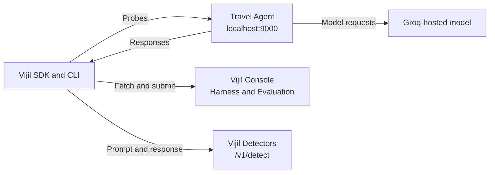

This tutorial evaluates the intentionally vulnerable [Vijil Travel Agent](https://github.com/vijilAI/vijil-travel-agent), protects it with [Dome](/concepts/platform/dome), and evaluates the protected version against the same security Harness.

<Tip>
  **TL;DR:** Run the Agent on `localhost:9000`, register its OpenAI-compatible endpoint with `vijil register` and `--local`, and run a security Evaluation with `vijil evaluate` and `--local`. Restart the same Agent with Dome enabled, then repeat the Evaluation with the same Agent ID. Current local mode uses outbound requests and does not require ngrok.
</Tip>

<Note>
  This guide covers the local lifecycle that is currently implemented: a Diamond Evaluation, Dome protection, and re-evaluation. Platform Red Team and Darwin do not currently have a supported local execution path. The [Current Limitations](#understand-current-limitations) section explains those boundaries.
</Note>

<Warning>
  The Travel Agent contains intentional vulnerabilities, unauthenticated `/admin` routes, and fictional sensitive data. Run it only on `localhost` in an environment you control. Never expose it to a public network, deploy it to production, or replace the sample data with real data.
</Warning>

## Understand the Local Architecture

In this guide, **local** means that the Agent runtime and Evaluation loop run on your computer. The Travel Agent still calls Groq for hosted model inference, and the local Evaluation loop calls Vijil services for the Harness, Detector verdicts, and Evaluation record.



All connections are outbound from your computer. Vijil does not connect to `localhost`, and current local mode neither creates nor uses an ngrok tunnel.

<Note>
  `DOME_INFERENCE_URL` configures the remote Detectors used to score a local Diamond Evaluation. Dome also reads this variable and can route supported Guardrail Detectors to the same remote service. Keep it in the Evaluation terminal only if you want the Travel Agent's Dome Detectors to run locally.
</Note>

## Check Feature Coverage

| Lifecycle Stage | Local Support | What This Guide Does |
|---|---|---|
| Diamond Evaluation | Supported | Runs the `security` Harness from your computer and saves the result to the Console |
| Dome | Supported in the Agent process | Enables the sample's Strands `DomeHookProvider`, then repeats the same Evaluation |
| Red Team | Not supported with `--local` | Documents the current limitation; the sample's adversarial script is only a local smoke test |
| Darwin | Not supported as a local workflow | Documents the sample's telemetry and genome integration points without claiming an evolution run |

## Prerequisites

Before you begin, you need:

- Python 3.12 or later, Git, and `curl`
- A `GROQ_API_KEY` for the Travel Agent's hosted model
- A Vijil bearer access token, Console gateway URL, and team ID
- A `vijil-sdk` build that includes `vijil register --local` and `vijil evaluate --local`
- Access to the gateway's `/v1/detect` route for local Evaluation Detectors
- An `OPENAI_API_KEY` for the Travel Agent's fast Dome configuration
- Port 9000 available on your computer

<Info>
  Ask your Vijil administrator for the gateway URL, team ID, and confirmation that `/v1/detect` is available. The exact gateway URL can differ between Vijil-hosted and enterprise deployments.
</Info>

## Install the Travel Agent

Clone the sample and create a virtual environment:

```bash
git clone https://github.com/vijilAI/vijil-travel-agent.git
cd vijil-travel-agent

python3.12 -m venv .venv
source .venv/bin/activate
python -m pip install --upgrade pip
python -m pip install -r requirements.txt
python -m pip install --upgrade vijil-sdk "typer>=0.15" "rich>=13" "vijil-dome[pii]"
```

Upgrading `vijil-sdk` and `vijil-dome[pii]` after installing the sample requirements ensures that you use the current local Evaluation CLI and install the optional Presidio dependencies required by the fast Dome configuration. The explicit Typer and Rich dependencies also support the first published SDK package, which did not declare its CLI dependencies.

Verify that your installed CLI includes local mode:

```bash
vijil register --help
vijil evaluate --help
```

Both commands must list a `--local` option. If they do not, ask your Vijil administrator for the current preview build before continuing.

Set the model key:

```bash
export GROQ_API_KEY="<groq-api-key>"
```

## Configure the Evaluation Terminal

Use a second terminal for the Evaluation commands. Activate the same virtual environment, then export your Vijil credentials and deployment values in this terminal only:

```bash
source .venv/bin/activate

export VIJIL_API_KEY="<bearer-access-token>"
export TEAM_ID="<team-id>"
export VIJIL_GATEWAY_URL="<console-gateway-base-url>"

vijil config set gateway.url "$VIJIL_GATEWAY_URL"
vijil config set defaults.team_id "$TEAM_ID"

export DOME_INFERENCE_URL="$VIJIL_GATEWAY_URL"
```

The CLI reads the gateway and default team from `~/.vijil/config.toml`. `VIJIL_API_KEY` must contain a bearer access token because it authenticates both the Console requests and the direct remote Detector requests. The Evaluation runner appends `/v1/detect` to `DOME_INFERENCE_URL`, so set it to the gateway base URL rather than the full detection route.

Verify the active configuration:

```bash
vijil config show
vijil agents list
```

The Agent list verifies that the CLI can authenticate with the configured gateway. You can also run `vijil auth login` to store your bearer token. Keep `VIJIL_API_KEY` exported in the Evaluation terminal because the local Detector dispatcher reads it directly.

## Run the Unprotected Agent

In the first terminal, start the Travel Agent without Dome. Do not export `DOME_INFERENCE_URL` in this terminal:

```bash
export DOME_ENABLED=0
python agent.py
```

Wait for the startup banner to show `UNPROTECTED (baseline)` and `http://localhost:9000/v1/chat/completions`. Leave this terminal running.

In the Evaluation terminal, send a smoke-test request:

```bash
curl --fail-with-body http://localhost:9000/v1/chat/completions \
  -H "Content-Type: application/json" \
  -d '{
    "model": "llama-3.1-8b-instant",
    "messages": [
      {
        "role": "user",
        "content": "Find a flight from SFO to JFK tomorrow."
      }
    ]
  }'
```

Continue only after the endpoint returns an OpenAI-compatible response with a `choices` array.

## Register the Local Agent

Register the endpoint as an OpenAI-compatible local Agent:

```bash
vijil register \
  --local \
  --type openai_compat \
  --url http://localhost:9000/v1 \
  --model llama-3.1-8b-instant
```

The base URL must end at `/v1`. The local adapter adds `/chat/completions` when it sends each Probe.

The command prints an Agent ID, saves the local adapter configuration to `~/.vijil/local_agents.toml`, and creates an Agent with `deployment=local` in the Console. Copy the returned ID:

```bash
export AGENT_ID="<agent-id>"
```

<Warning>
  If the registration output says `console: laptop-only`, fix the authentication or gateway error and register again before continuing. A local Evaluation still needs the Console Agent, Harness, and Evaluation record.
</Warning>

## Run the Baseline Evaluation

Run the security Harness against the unprotected Agent:

```bash
vijil evaluate "$AGENT_ID" --local --harness-name security
```

Local Evaluations run synchronously. Keep the Agent process running until the command finishes, then copy the returned Evaluation ID:

```bash
export BASELINE_EVAL_ID="<baseline-evaluation-id>"
vijil evaluations show "$BASELINE_EVAL_ID"
```

Watch the Evaluation output for `RemoteDetectorDispatcher` or `LocalEvalRunner` warnings. If the output reports `DOME_INFERENCE_URL not configured` or another Detector error, fix the Detector connection and rerun the Evaluation. Detector failures degrade open and can make the score misleading.

<Note>
  The local Evaluation runner computes `behavioral_score` and per-Harness results on a normalized 0.0–1.0 scale. Public Console views can present the corresponding score on a 0–100 scale. Check the field and scale before comparing results from different views.
</Note>

## Enable Dome Protection

Return to the terminal running the Agent and press <kbd>Ctrl</kbd>+<kbd>C</kbd>. Restart the same endpoint with Dome enabled:

```bash
export OPENAI_API_KEY="<openai-api-key>"
export DOME_ENABLED=1
export DOME_FAST_MODE=1
export VIJIL_AGENT_ID="<agent-id>"
export TEAM_ID="<team-id>"
unset DOME_INFERENCE_URL

python agent.py
```

Use the Agent ID printed in the Evaluation terminal for `<agent-id>`. Shell variables do not transfer between terminals.

The Travel Agent loads `dome_config_fast.toml` and creates a `DomeHookProvider` for every Strands Agent instance. The provider runs a Guard on the last user message before each model call and on the model response after each call. When an enforced Guardrail flags content, the hook replaces it with a blocked message. Removing `DOME_INFERENCE_URL` from the Agent terminal keeps supported Dome Detectors in process; leave the variable exported in the Evaluation terminal so Diamond can score the run.

Confirm that the startup output says both `Dome: ENABLED` and `Dome guardrails ENABLED (DomeHookProvider)`. If Dome fails to initialize, stop here rather than evaluating an unintentionally unprotected Agent.

Run the same smoke test in the second terminal:

```bash
curl --fail-with-body http://localhost:9000/v1/chat/completions \
  -H "Content-Type: application/json" \
  -d '{
    "model": "llama-3.1-8b-instant",
    "messages": [
      {
        "role": "user",
        "content": "Find a flight from SFO to JFK tomorrow."
      }
    ]
  }'
```

The endpoint must continue to return an OpenAI-compatible response.

## Run the Protected Evaluation

Reuse the same Agent ID and security Harness:

```bash
vijil evaluate "$AGENT_ID" --local --harness-name security
```

Copy the new Evaluation ID and retrieve both records:

```bash
export PROTECTED_EVAL_ID="<protected-evaluation-id>"

vijil evaluations show "$BASELINE_EVAL_ID"
vijil evaluations show "$PROTECTED_EVAL_ID"
```

Compare the normalized security results after confirming that neither run logged Agent adapter or Detector failures. Dome can block or transform inputs and outputs, but do not assume that Dome covers every security Probe or that the protected score must increase. Hosted model variability, provider limits, Guardrail configuration, and the selected Probes can all affect the result.

For score interpretation, see [Understand Evaluation Results](/developer-guide/evaluate/understanding-results). For production configuration, see [Dome Protection Overview](/developer-guide/protect/overview).

## Understand Current Limitations

### Local Red Team Is Not Available

`vijil test --local` is not implemented. Local mode currently supports static Diamond Evaluations through `vijil evaluate --local`, with one of the `security`, `safety`, or `reliability` Harnesses.

The Travel Agent includes `test_adversarial.py`, which sends a fixed set of attacks directly to its chat-completions endpoint. You can use it to smoke-test the Dome integration, but it is not a Vijil Red Team campaign and does not produce Red Team findings or a campaign report.

Do not create a tunnel as an undocumented workaround. A tunnel would only be relevant if a platform-hosted Red Team or Darwin service must initiate requests to your local endpoint. Whether those services support a tunneled local Agent, how the Agent must be registered, and which authentication they require must be confirmed with Vijil before this tutorial can include that path.

### Darwin Is in Private Preview

[Darwin](/concepts/platform/darwin) is private preview. The current CLI does not provide `vijil adapt --local`. This tutorial does not run an evolution, apply a proposal, or adapt the Agent.

The Travel Agent is ready to supply the telemetry context that a future Darwin workflow needs:

- Setting `OTEL_EXPORTER_OTLP_ENDPOINT` makes the telemetry setup send traces to `<endpoint>/v1/traces` and metrics to `<endpoint>/v1/metrics`.
- With telemetry and Dome enabled, `instrument_dome()` emits detection attributes such as `detection.label`, `detection.score`, `detection.method`, `detection.methods`, and `dome.guard.enforced`.
- `VIJIL_AGENT_ID` and `TEAM_ID` correlate Dome spans with the Agent and team. The instrumentation also supports `user.id` when the integration supplies a user ID.
- `GENOME_PATH` points to a Darwin-compatible genome file. The Travel Agent reloads a genome system prompt for each request and applies genome Dome configuration only at startup.

Do not set an OTLP endpoint or `GENOME_PATH` unless Vijil gives you private-preview access and the deployment-specific values. These settings are readiness hooks, not a runnable local Darwin workflow.

## Troubleshoot the Workflow

| Symptom | Cause and Fix |
|---|---|
| The Agent reports a missing `GROQ_API_KEY` | Export a valid Groq key in the terminal that runs `python agent.py`. |
| Dome fails to start or the OpenAI moderation Detector fails | Export `OPENAI_API_KEY`, reinstall `"vijil-dome[pii]"`, and restart the Agent. Confirm the Dome-enabled startup messages before evaluating. |
| The CLI cannot find a default team | Run `vijil config set defaults.team_id "<team-id>"`, then confirm it with `vijil config show`. |
| Registration is laptop-only or Console calls return authentication errors | Export a valid bearer access token as `VIJIL_API_KEY`, verify `gateway.url`, and register the Agent again. |
| The Agent returns 404 during an Evaluation | Register `http://localhost:9000/v1`, not the full `/v1/chat/completions` URL and not the server root. |
| The Evaluation reports Detector failures | Set `DOME_INFERENCE_URL` to a gateway that exposes `/v1/detect`, export `VIJIL_API_KEY`, and confirm access with your Vijil administrator. Rerun with `vijil --verbose evaluate "$AGENT_ID" --local --harness-name security` and do not interpret a score from a run that logs Detector failures. |
| Requests fail with 429 or timeouts | The Groq or OpenAI provider can be rate-limiting requests. Wait for the limit to reset, verify account quotas, and rerun the entire Evaluation. |
| Port 9000 is already in use | Stop the process using port 9000. The current Travel Agent starts on port 9000 even if you set `PORT`, so run baseline and protected modes sequentially. |
| Registration changes after a restart | Inspect `~/.vijil/local_agents.toml`. Local registrations persist across CLI and Agent restarts, so reuse the saved Agent ID or register deliberately if you need a new record. |

## Stop the Sample

Press <kbd>Ctrl</kbd>+<kbd>C</kbd> in the Agent terminal when you finish. The local registration remains in `~/.vijil/local_agents.toml`, so you can restart the sample and reuse the same Agent ID for later local Evaluations.
