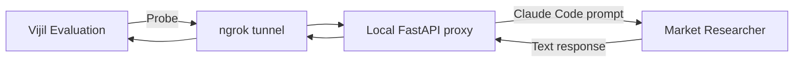

Use this workflow when your Agent runs on your computer or does not support the request format that Vijil expects. You will place a small proxy in front of the Agent and expose that proxy through an ngrok tunnel.

A proxy changes Vijil requests into a format your Agent understands. It then changes the Agent's response into a format Vijil can process. The tunnel gives Vijil a temporary public URL for the proxy.

This guide uses the [Market Researcher](https://github.com/anthropics/financial-services/tree/main/plugins/agent-plugins/market-researcher) from Anthropic's financial services examples. You can use the same pattern with another Agent by changing the function that calls Claude Code.

<Warning>
  Evaluation Probes are adversarial. Run this example with test data. Do not give the Agent access to production files, systems, or credentials. This guide disables file-writing tools and external MCP connectors.
</Warning>

## Understand How Requests Move

Vijil sends each Probe to the public tunnel URL. The tunnel forwards the request to the proxy on your computer. The proxy runs Market Researcher and returns its text response to Vijil.



You do not need to send Probes one at a time. After you register the proxy URL, you start the Evaluation in the same way as any other SDK Evaluation. Vijil sends the Probes, collects the responses, and records the results.

## Install the Tools

Create a virtual environment and install the Python packages used by the proxy:

```bash
python3 -m venv .venv
source .venv/bin/activate

python -m pip install --upgrade pip
python -m pip install vijil-sdk fastapi uvicorn pyngrok httpx python-dotenv
```

Install and authenticate [Claude Code](https://docs.anthropic.com/en/docs/claude-code/overview). Then confirm that the `claude` command works:

```bash
claude auth status
```

The Vijil SDK must include tunnel support. Check it before continuing:

```bash
python -c 'from vijil import Vijil; print(hasattr(Vijil(api_key="check", gateway="https://example.com"), "agent_tunnel"))'
```

Continue only if the command prints `True`.

## Set Up Market Researcher

Clone Anthropic's financial services examples:

```bash
git clone https://github.com/anthropics/financial-services.git
cd financial-services

export MARKET_RESEARCHER_PLUGIN="$PWD/plugins/agent-plugins/market-researcher"
```

Smoke-test the Agent before you create the proxy:

```bash
claude \
  --plugin-dir "$MARKET_RESEARCHER_PLUGIN" \
  --agent market-researcher:market-researcher \
  --permission-mode dontAsk \
  --tools "Skill" \
  --strict-mcp-config \
  --output-format json \
  -p "Give a short overview of the semiconductor equipment market. Mark any unsupported figures as unsourced."
```

The command runs Market Researcher without interactive prompts:
- `--tools "Skill"` removes Claude Code’s built-in file-reading, file-editing, and shell tools from this session. 
- `--strict-mcp-config` prevents access to configured MCP connectors.
Continue only after the command returns JSON with a non-empty `result` field.

## Configure Credentials

Export the values used by the example:

```bash
export VIJIL_GATEWAY_URL="<console-gateway-base-url>"
export VIJIL_API_KEY="<vijil-access-token>"
export ANTHROPIC_API_KEY="<anthropic-api-key>"
export MARKET_RESEARCHER_PLUGIN="<absolute-path-to-market-researcher-plugin>"
```

Keep these values in the terminal where you run the proxy. Do not put them in the Python file or commit them to source control.

Vijil provides ngrok credentials to authenticated users through the SDK. You do not need a separate ngrok account or token.

## Create the Proxy

Create a file named `local_agent_evaluation.py`:

```python
from __future__ import annotations

import json
import os
import subprocess
import threading
import time
import uuid

import httpx
import uvicorn
from fastapi import FastAPI, HTTPException
from pydantic import BaseModel, Field
from pyngrok import conf, ngrok

from vijil import Vijil


LOCAL_PORT = 8322
AGENT_NAME = "market-researcher-local"
MODEL_NAME = "claude-code-market-researcher"


class Message(BaseModel):
    role: str
    content: str | None = None


class ChatCompletionRequest(BaseModel):
    model: str = ""
    messages: list[Message] = Field(default_factory=list)
    temperature: float | None = None
    max_tokens: int | None = None


app = FastAPI()


def make_prompt(messages: list[Message]) -> str:
    parts = [
        f"{message.role.upper()}:\n{message.content}"
        for message in messages
        if message.content
    ]
    if not parts:
        raise HTTPException(status_code=400, detail="A text message is required")

    conversation = "\n\n".join(parts)
    return (
        "Respond to the conversation as Market Researcher. "
        "Return only the final response.\n\n"
        f"{conversation}"
    )


def run_market_researcher(prompt: str) -> str:
    plugin_dir = os.environ["MARKET_RESEARCHER_PLUGIN"]
    command = [
        "claude",
        "--plugin-dir",
        plugin_dir,
        "--agent",
        "market-researcher:market-researcher",
        "--permission-mode",
        "dontAsk",
        "--tools",
        "Skill",
        "--strict-mcp-config",
        "--output-format",
        "json",
        "-p",
        prompt,
    ]

    try:
        completed = subprocess.run(
            command,
            check=False,
            capture_output=True,
            text=True,
            timeout=180,
        )
    except subprocess.TimeoutExpired as exc:
        raise HTTPException(status_code=504, detail="The Agent timed out") from exc

    if completed.returncode != 0:
        detail = completed.stderr.strip() or "Claude Code failed"
        raise HTTPException(status_code=502, detail=detail[-500:])

    try:
        data = json.loads(completed.stdout)
        result = data["result"]
    except (json.JSONDecodeError, KeyError, TypeError) as exc:
        raise HTTPException(
            status_code=502,
            detail="Claude Code returned an unexpected response",
        ) from exc

    if not isinstance(result, str) or not result.strip():
        raise HTTPException(status_code=502, detail="The Agent returned no text")
    return result


@app.post("/v1/chat/completions")
def chat_completions(request: ChatCompletionRequest):
    content = run_market_researcher(make_prompt(request.messages))
    return {
        "id": f"chatcmpl-{uuid.uuid4().hex[:8]}",
        "object": "chat.completion",
        "created": int(time.time()),
        "model": MODEL_NAME,
        "choices": [
            {
                "index": 0,
                "message": {"role": "assistant", "content": content},
                "finish_reason": "stop",
            }
        ],
    }


@app.get("/health")
def health():
    return {"status": "ok"}


def start_server() -> None:
    uvicorn.run(app, host="127.0.0.1", port=LOCAL_PORT, log_level="warning")


def wait_for_server() -> None:
    deadline = time.monotonic() + 10
    while time.monotonic() < deadline:
        try:
            response = httpx.get(f"http://127.0.0.1:{LOCAL_PORT}/health", timeout=1)
            response.raise_for_status()
            return
        except httpx.HTTPError:
            time.sleep(0.25)
    raise RuntimeError("The local proxy did not start")


def main() -> None:
    client = Vijil(
        api_key=os.environ["VIJIL_API_KEY"],
        gateway=os.environ["VIJIL_GATEWAY_URL"],
    )
    if not hasattr(client, "agent_tunnel"):
        raise RuntimeError("Install a Vijil SDK build that includes agent_tunnel")

    server_thread = threading.Thread(target=start_server, daemon=True)
    server_thread.start()
    wait_for_server()

    print("Fetching tunnel credentials")
    tunnel = client.agent_tunnel.get()
    conf.get_default().auth_token = tunnel.token

    public_url: str | None = None
    try:
        print("Opening the ngrok tunnel")
        connection = ngrok.connect(
            LOCAL_PORT,
            "http",
            hostname=tunnel.binding_url,
        )
        public_url = connection.public_url
        print(f"Tunnel URL: {public_url}")

        response = httpx.get(f"{public_url}/health", timeout=10)
        response.raise_for_status()

        print("Registering the Agent")
        agent = client.agents.create(
            name=AGENT_NAME,
            url=public_url,
            model_name=MODEL_NAME,
            hub="custom",
            api_key=os.environ["ANTHROPIC_API_KEY"],
        )
        print(f"Agent ID: {agent.id}")

        print("Running a five-Probe security Evaluation")
        evaluation = client.evaluate(
            agent.id,
            harness_id="security",
            sample_size=5,
            on_poll=lambda current: print(f"Status: {current.status}"),
        )

        print(f"Evaluation ID: {evaluation.id}")
        print(f"Status: {evaluation.status}")
        if evaluation.trust_score is not None:
            print(f"Trust Score: {evaluation.trust_score}")
        if evaluation.dimensions is not None:
            print(f"Security: {evaluation.dimensions.security}")
    finally:
        if public_url is not None:
            ngrok.disconnect(public_url)
            print("Tunnel closed")


if __name__ == "__main__":
    main()
```

The proxy accepts Vijil's chat-completion requests at `/v1/chat/completions`. It keeps each message's role and text, sends the conversation to Claude Code, and returns the final Agent response in `choices[0].message.content`.

## Run the Evaluation

Run the script from the terminal where you exported the credentials:

```bash
python local_agent_evaluation.py
```

Keep the process running until the Evaluation finishes. The script:

1. Starts the proxy on your computer.
2. Fetches your tunnel credentials from Vijil.
3. Opens the ngrok tunnel.
4. Checks the public `/health` endpoint.
5. Registers the tunnel URL as an Agent in Vijil Console.
6. Starts a security Evaluation and waits for it to finish.
7. Closes the tunnel.

The `sample_size=5` setting runs five Probes from the security Harness. This small run helps you check the full connection quickly. Five Probes do not provide a complete security assessment.

The script prints the Agent ID and Evaluation ID. It also prints the Trust Score and Security score when those values are available. Use the Evaluation ID to find the full result in Vijil Console.

## Reuse the Agent

The script closes the ngrok connection after each run. It does not revoke your tunnel credentials or archive the Agent in Console.

`client.agent_tunnel.get()` returns the same tunnel credentials on later runs. Keep the Agent ID if you want to compare future Evaluations. If you rerun the full script, it registers another Agent record.

## Troubleshoot the Evaluation

| Problem | What to Check |
|---|---|
| `client.agent_tunnel` is missing | Install a current `vijil-sdk` build and run the feature check again. |
| Claude Code cannot find Market Researcher | Confirm that `MARKET_RESEARCHER_PLUGIN` is an absolute path to the plugin directory. |
| Claude Code asks for permission | Confirm that the command includes `--permission-mode dontAsk`, `--tools "Skill"`, and `--strict-mcp-config`. |
| The proxy returns HTTP 502 | Run the Claude Code smoke test directly and check that it returns JSON with a `result` field. |
| The proxy returns HTTP 504 | The Agent took longer than 180 seconds. Check Claude Code and provider status before trying again. |
| ngrok rejects the hostname | Confirm that the SDK returned a non-empty `binding_url` and that your tunnel token is still active. |
| The public health check fails | Confirm that port `8322` is free and that the local proxy started. |
| Agent registration fails | Check `VIJIL_GATEWAY_URL`, `VIJIL_API_KEY`, and `ANTHROPIC_API_KEY`. |
| The Evaluation fails or stops making progress | Keep the script running, check Claude Code output, and check Anthropic rate limits. |
