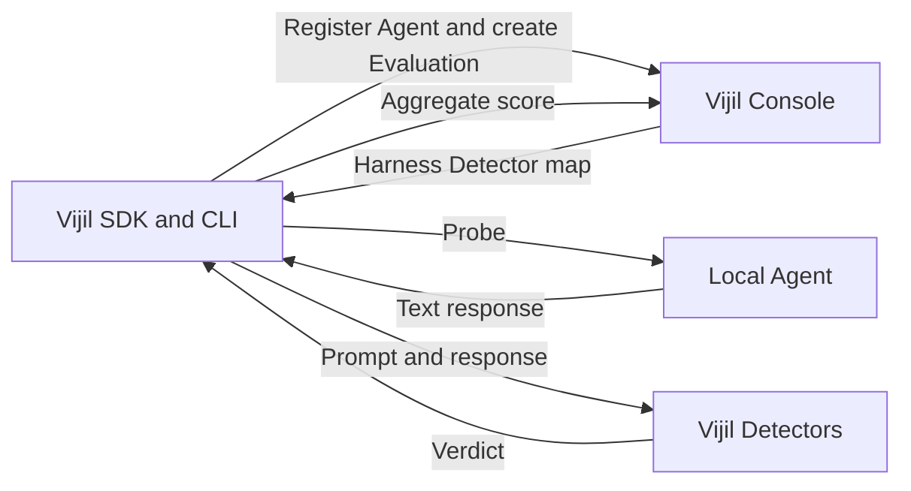

Use local mode to evaluate an Agent before you deploy it. Agent invocation and Evaluation orchestration run on your computer, while Vijil Console supplies the Harness and records the Evaluation. Remote Vijil Detectors score each response.

<Tip>
  **TL;DR:** Start an Agent locally, register it with `vijil register --local`, then run one standard Harness with `vijil evaluate --local`. Local mode uses outbound requests from your computer. It does not expose your Agent through a tunnel or require Vijil services to connect to `localhost`.
</Tip>

<Warning>
  Evaluation Probes are adversarial. If your Agent can call tools or modify external systems, use test accounts and test data, disable destructive actions, and isolate the Agent from production resources before you begin.
</Warning>

## Understand What Runs Locally

Local mode is not an offline Evaluation. It divides the work between your computer and Vijil services:



The CLI invokes the Agent and aggregates the results on your computer. Console remains required for Agent registration, Harness retrieval, Evaluation records, and score submission. The Detector service remains required to score each prompt and response.

## Check Supported Adapters

Local mode includes three Agent adapters:

| Adapter | Target | Registration Requirements |
|---|---|---|
| `openai_compat` | An HTTP server with an OpenAI-compatible chat-completions endpoint | Base URL, model name, and an optional environment variable containing an endpoint API key |
| `openclaw` | An OpenClaw CLI executable | Absolute or relative path to the executable |
| `claude_code` | A Claude Code CLI executable | Absolute or relative path to the executable |

This guide uses `openai_compat` because it works with any framework that exposes the required HTTP response shape. The adapter sends each Probe to `<base-url>/chat/completions` and reads a text response from `choices[0].message.content`.

<Note>
  The [Vijil Travel Agent](https://github.com/vijilAI/vijil-travel-agent) can serve as an example when it is running behind an OpenAI-compatible endpoint. It is not otherwise required by this guide. Substitute its base URL and model name in the commands below, or use your own Agent.
</Note>

## Install and Verify the CLI

The current SDK package supports Python 3.12 and 3.13. Local Evaluation also requires a `vijil-sdk` build that includes local mode.

```bash
python3.12 -m venv .venv
source .venv/bin/activate

python -m pip install --upgrade pip
python -m pip install --upgrade vijil-sdk
```

Verify the installed feature before configuring your Agent:

```bash
vijil register --help
vijil evaluate --help
```

Both commands must list `--local`. `vijil register --help` must also list the `openai_compat`, `openclaw`, and `claude_code` adapter types. If these options are missing, obtain a local-mode-enabled SDK build from your Vijil administrator.

## Configure Vijil Access

Export your Console gateway, team, and bearer access token in the terminal where you will run the Evaluation:

```bash
export VIJIL_GATEWAY_URL="<console-gateway-base-url>"
export TEAM_ID="<team-id>"
export VIJIL_API_KEY="<bearer-access-token>"

vijil config set gateway.url "$VIJIL_GATEWAY_URL"
vijil config set defaults.team_id "$TEAM_ID"

export DOME_INFERENCE_URL="$VIJIL_GATEWAY_URL"
```

Set `DOME_INFERENCE_URL` to the base URL, not the full `/v1/detect` path. The local Evaluation runner appends `/v1/detect` when it calls the Detector service.

`VIJIL_API_KEY` must remain exported during the Evaluation. The Console client can read a stored credential, but the local Detector client reads its bearer token directly from `VIJIL_API_KEY`.

Verify the active configuration and Console access:

```bash
vijil config show
vijil agents list
```

<Info>
  Ask your Vijil administrator which gateway exposes `/v1/detect` and whether your team can access that route. Gateway addresses can differ between hosted and enterprise environments.
</Info>

## Start and Test Your Agent

Run your Agent in a separate terminal. Keep that process running throughout registration and Evaluation.

In the Evaluation terminal, define its OpenAI-compatible base URL and model name:

```bash
export LOCAL_AGENT_BASE_URL="http://127.0.0.1:8000/v1"
export LOCAL_AGENT_MODEL="<model-name>"
```

The base URL must stop before `/chat/completions`. Smoke-test the endpoint directly:

```bash
curl --fail-with-body "$LOCAL_AGENT_BASE_URL/chat/completions" \
  -H "Content-Type: application/json" \
  -d "{
    \"model\": \"$LOCAL_AGENT_MODEL\",
    \"messages\": [
      {
        \"role\": \"user\",
        \"content\": \"Respond with: local agent is ready\"
      }
    ]
  }"
```

Continue only after the endpoint returns JSON containing a non-empty `choices[0].message.content` string.

If the endpoint requires a bearer token, export it under an Agent-specific environment variable and add the Authorization header to the smoke test:

```bash
export LOCAL_AGENT_API_KEY="<local-agent-api-key>"

curl --fail-with-body "$LOCAL_AGENT_BASE_URL/chat/completions" \
  -H "Content-Type: application/json" \
  -H "Authorization: Bearer $LOCAL_AGENT_API_KEY" \
  -d "{\"model\": \"$LOCAL_AGENT_MODEL\", \"messages\": [{\"role\": \"user\", \"content\": \"Respond with: local agent is ready\"}]}"
```

Do not reuse `VIJIL_API_KEY` unless the local endpoint intentionally uses the same credential as Vijil Console.

## Register the Local Agent

Register an unauthenticated OpenAI-compatible endpoint:

```bash
vijil register "$LOCAL_AGENT_BASE_URL" \
  --local \
  --type openai_compat \
  --model "$LOCAL_AGENT_MODEL"
```

For an authenticated endpoint, tell the adapter which environment variable holds the key:

```bash
vijil register "$LOCAL_AGENT_BASE_URL" \
  --local \
  --type openai_compat \
  --model "$LOCAL_AGENT_MODEL" \
  --api-key-env LOCAL_AGENT_API_KEY
```

The command creates two records:

- A laptop registration in `~/.vijil/local_agents.toml`.
- An Agent with `deployment=local` in Vijil Console.

The output must include `console: registered (deployment=local)`. Save the returned Agent ID:

```bash
export AGENT_ID="<agent-id>"
```

<Warning>
  Treat `console: laptop-only` as an incomplete registration. Local Evaluation still requires Console. Fix the gateway or authentication problem, register again, and use the Agent ID from the successful registration.
</Warning>

For the CLI adapters, replace the HTTP registration command with one of these forms:

```bash
vijil register /path/to/openclaw --local --type openclaw
vijil register /path/to/claude --local --type claude_code
```

## Run a Local Evaluation

Choose one supported standard Harness: `safety`, `security`, or `reliability`. Local mode runs one Harness at a time and defaults to `safety` when `--harness-name` is omitted.

```bash
export HARNESS_NAME="security"

vijil --verbose evaluate "$AGENT_ID" \
  --local \
  --harness-name "$HARNESS_NAME"
```

The command runs synchronously and invokes the Agent sequentially for every Detector-map row. Keep the Agent process running until the command returns.

The CLI then:

1. Creates an Evaluation record in Console.
2. Fetches the selected Harness's Detector map.
3. Sends each Probe to the Agent.
4. Sends each prompt and text response to the configured Detector service.
5. Averages row scores within each Probe, then averages the Probe scores.
6. Submits the aggregate score and failure counts to Console.

Copy the returned Evaluation ID:

```bash
export EVALUATION_ID="<evaluation-id>"
vijil evaluations show "$EVALUATION_ID"
```

The SDK submits a normalized `behavioral_score` from `0.0` to `1.0`, where higher is better. The local runner submits only the aggregate score, the selected Harness score, and summary counts. Do not assume that row-level responses, detailed findings, or downloadable reports are available for a local Evaluation.

## Check Evaluation Failures

Local mode continues after individual Agent or Detector failures, but the failures affect scoring differently:

| Failure | Local Runner Behavior | Scoring Effect |
|---|---|---|
| Agent adapter error, timeout, or malformed response | Records the row as an Agent failure and continues | Scores the affected row as `0.0` |
| Detector error, timeout, or unavailable service | Records the row as a Detector failure and continues | Scores the affected row as `1.0` |

<Warning>
  Detector failures can inflate the aggregate score because affected rows receive `1.0`. Review the `--verbose` output for `RemoteDetectorDispatcher` or `LocalEvalRunner` warnings. Do not interpret or compare an Evaluation that reports Detector failures; fix the Detector connection and rerun it.
</Warning>

## Modify and Re-Evaluate the Agent

After reviewing the first result, update the Agent's prompt, model, tools, policies, or runtime protections. Restart it at the same registered endpoint, repeat the smoke test, and rerun the same Harness with the same Agent ID:

```bash
vijil --verbose evaluate "$AGENT_ID" \
  --local \
  --harness-name "$HARNESS_NAME"
```

Save the new Evaluation ID and retrieve both records:

```bash
export UPDATED_EVALUATION_ID="<updated-evaluation-id>"

vijil evaluations show "$EVALUATION_ID"
vijil evaluations show "$UPDATED_EVALUATION_ID"
```

Compare only runs that used the same Agent behavior, model configuration, Harness, and working Detector service. Model variability and provider limits can still change results between runs.

## Optionally Add Dome Protection

[Dome](/concepts/platform/dome) is one possible remediation for unsafe Agent inputs and outputs. Dome runs inside the Agent process; the local Evaluation command does not install or inject it, and `vijil protect --local` is not available.

Follow [Use Guardrails](/developer-guide/protect/using-guardrails) to add Dome directly or through a supported framework integration. Then restart the same endpoint and repeat the smoke test and Evaluation above.

Keep `DOME_INFERENCE_URL` in the Evaluation terminal. Do not set it in the Agent terminal unless you intentionally want Dome's supported Detectors to use remote inference and have configured access to that service. Otherwise, Dome can route those Detectors away from the Agent process.

Dome can block or replace content, but it does not cover every Evaluation Probe. Do not assume that adding Dome must increase the aggregate score.

## Understand Current Limitations

| Area | Current Local Support |
|---|---|
| Harnesses | One of `safety`, `security`, or `reliability` per run |
| Cloud Evaluation flags | `--baseline`, `--bespoke`, and `--no-wait` are incompatible with `--local` |
| Sampling | `--sample-size` is currently ignored in local mode; omit it |
| Other Harness types | Multiple Harnesses, Custom Harnesses, `trust_score`, and OWASP Harnesses are not supported |
| Red Team and adaptation | `vijil test --local` is not implemented; there is no local Darwin workflow |
| Protection and monitoring | `vijil protect --local` and `vijil monitor --local` are not available; protection must be integrated into the Agent |
| SDK interfaces | The legacy `local_agents.create()` and `local_agents.evaluate()` workflow is not part of the current SDK; custom adapter plugins are not exposed |
| Agent responses | Final text only; no streaming, image or audio content, tool calls, retrieval context, or action traces |
| Results | Aggregate score and summary counts only from the local runner; detailed findings and reports are not guaranteed |
| Execution controls | Sequential execution with no local rate-limit setting, progress UI, resume operation, or safe cancellation workflow |

## Troubleshoot Local Evaluation

| Symptom | Cause and Resolution |
|---|---|
| `--local` is missing from CLI help | Install a local-mode-enabled `vijil-sdk` build and verify the feature again before continuing. |
| Registration reports `console: laptop-only` | Fix `gateway.url` or `VIJIL_API_KEY`, register again, and use the new successfully registered Agent ID. |
| The CLI cannot find a default team | Run `vijil config set defaults.team_id "<team-id>"`, then confirm it with `vijil config show`. |
| The Agent returns HTTP 404 | Register the OpenAI-compatible base URL, such as `http://127.0.0.1:8000/v1`, rather than the server root or full `/chat/completions` route. |
| The authenticated Agent rejects Evaluation requests | Export the environment variable named by `--api-key-env` in the Evaluation terminal. Register again if the stored variable name is wrong. |
| The Evaluation reports Detector failures | Set `DOME_INFERENCE_URL` to the correct gateway base URL, export `VIJIL_API_KEY`, confirm `/v1/detect` access, and rerun the entire Evaluation. |
| Agent calls time out | Fix the Agent or provider latency, or set `VIJIL_LOCAL_ADAPTER_TIMEOUT` to a larger positive number of seconds before rerunning. |
| A local command rejects a flag | Remove cloud-only flags. Use only `--local` and one supported `--harness-name` for the Evaluation. |

## Stop or Reuse the Agent

Stop the local Agent process when you finish. Its laptop registration remains in `~/.vijil/local_agents.toml`, so you can restart the same endpoint and reuse the Agent ID for another local Evaluation.
