<Tip>
**TL;DR:** Diamond sends adversarial [Probes](/concepts/evaluation-components/probe) to your [agent](/owner-guide/register-agents/what-is-an-agent) and returns a [Trust Score](/concepts/trust-score/introduction) (0–100) across [Reliability](/concepts/trust-score/reliability), [Security](/concepts/trust-score/security), and [Safety](/concepts/trust-score/safety). Use the `trust_score` [Harness](/concepts/evaluation-components/harness) for comprehensive pre-deployment validation, or a dimension-specific Harness for targeted testing. A score at or above 70 meets the deployment threshold.
</Tip>

Agents' evaluation is at the core of Vijil.

<Note>
  Programmatic evaluation via the Python client and REST API is in private preview. For stable access, use the [Console](/owner-guide/getting-started/introduction) or [CLI](/developer-guide/cli/quickstart).
</Note>

Your agent works in demos. Your unit tests pass. But how do you know it will not hallucinate facts, leak customer data, or comply with malicious instructions when it encounters inputs you did not anticipate?

Diamond is Vijil's evaluation platform. It sends hundreds of adversarial Probes to your agent (prompt injections, jailbreak attempts, data exfiltration payload, etc.) and measures how your agent responds. You get a quantified Trust Score and specific findings you can fix before deployment.

## How Evaluation Works

Diamond sends test Probes to your agent and analyzes the responses:

```mermaid actions={false}
%%{init: {'theme':'base', 'themeVariables': {'fontFamily':'Futura Medium, Futura, sans-serif','fontSize':'13px'}, 'flowchart': {'nodeSpacing':25,'rankSpacing':40,'padding':6}}}%%
flowchart LR
    Harness[Harness]
    Scenario[Scenario]
    Probe[Probe]
    Prompt[Prompt]
    Agent((Trusted Agent))
    Response[Response]
    Detector[Detector]
    PassRate[Pass Rate]
    TrustScore[Trust Score]

    Harness --> Scenario --> Probe --> Prompt --> Agent
    Agent --> Response --> Detector --> PassRate --> TrustScore

    classDef blueFill  fill:#0247A9,stroke:#2B0C0C,color:#FFFFFF,stroke-width:1px;
    classDef blueLine  fill:#FFFFFF,stroke:#0247A9,color:#0247A9,stroke-width:1.5px;
    classDef redLine   fill:#FFFFFF,stroke:#DE1616,color:#DE1616,stroke-width:1.5px;
    classDef redFill   fill:#DE1616,stroke:#2B0C0C,color:#FFFFFF,stroke-width:1px;

    class Harness,Agent blueFill;
    class Scenario,Probe,Prompt blueLine;
    class Response,Detector,PassRate redLine;
    class TrustScore redFill;
```

| Component | Purpose |
|-----------|---------|
| **Harness** | Collection of Scenarios to run (e.g., `trust_score`, `security`) |
| **Scenario** | Testing context with personas and policies |
| **Probe** | Individual test case sent to your agent |
| **Detector** | Analyzes agent responses to identify failures |

## Trust Score

The Trust Score is a composite metric (0 to 100) based on three pillars:

| Dimension | What It Measures |
|-----------|------------------|
| **Reliability** | Hallucination resistance, consistency, accuracy |
| **Security** | Prompt injection, data leakage, jailbreak resistance |
| **Safety** | Harmful content, policy compliance, ethical behavior |

Higher scores indicate more trustworthy behavior. Use scores to:

- Set deployment gates (e.g., require Trust Score ≥ 70)
- Compare agent versions
- Track improvements over time
- Identify specific vulnerabilities

## Evaluation Options

### Cloud-Hosted Agents

Evaluate agents deployed on supported cloud platforms such as OpenAI, Anthropic, AWS Bedrock, Google Vertex AI, DigitalOcean, and any OpenAI-compatible endpoint.

### Local Agents

Evaluate agents running locally without deployment. This creates a temporary authenticated tunnel (via ngrok) for Vijil to communicate with your local agent.

## Available Harnesses

| Harness | Description | Use Case |
|---------|-------------|----------|
| `trust_score` | Comprehensive evaluation across all dimensions | Pre-deployment validation |
| `security` | Prompt injection, jailbreaks, data leakage | Security review |
| `reliability` | Hallucination, consistency, accuracy | Quality assurance |
| `safety` | Harmful content, ethics, policy compliance | Safety review |
| `owasp-llm-top-10` | OWASP Top 10 for LLM Applications | Compliance |

Add `_Small` suffix (e.g., `security_Small`) for faster iterations during development.

## Evaluation Workflow

<Steps>
  <Step title="Choose your integration method">
    Use cloud provider integration for deployed agents, or LocalAgentExecutor for local development
  </Step>
  <Step title="Select harnesses">
    Start with `trust_score` for comprehensive coverage, or specific Harnesses for targeted testing
  </Step>
  <Step title="Run evaluation">
    Execute via Python client, REST API, or console
  </Step>
  <Step title="Analyze results">
    Review Trust Score, dimension scores, and individual failures
  </Step>
  <Step title="Remediate issues">
    Fix vulnerabilities, improve prompts, add Guardrails
  </Step>
  <Step title="Re-evaluate">
    Confirm fixes and track improvement
  </Step>
</Steps>

## Rate Limiting

Control the evaluation pace to avoid overwhelming your agent or hitting API limits during evaluations.

| Sample Size | Use Case |
|-------------|----------|
| 10–50 Probes | Fast iteration during development |
| 100–500 Probes | Pre-release validation |
| Full Harness | Comprehensive production gate |

Use the `_Small` Harness variants (e.g., `security_Small`) for faster iteration runs that sample a representative subset of Probes.

<Card title="Work in Progress" icon="pickaxe" badge="Private preview">
  The programmatic evaluation capabilities are currently in private preview and subject to change.
</Card>

## Next Steps

<CardGroup cols={2}>
  <Card title="Run Evaluations" icon="play" href="/developer-guide/evaluate/running-evaluations">
    Execute evaluations and monitor progress
  </Card>
  <Card title="Understand Results" icon="chart-bar" href="/developer-guide/evaluate/understanding-results">
    Interpret scores and failures
  </Card>
  <Card title="Cloud Providers" icon="cloud" href="/developer-guide/evaluate/cloud-providers">
    Configure cloud platform integrations
  </Card>
  <Card title="Custom Harnesses" icon="wrench" href="/developer-guide/evaluate/custom-harnesses">
    Create targeted evaluation Scenarios
  </Card>
</CardGroup>
