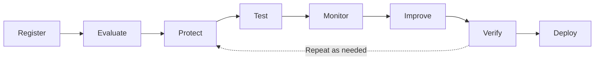

This guide takes an existing AI Agent from registration to a protected, evidence-backed production release. You can complete each stage through the Console or programmatically with the SDK.

<Info>
This workflow starts with registration and does not cover Discover or creating a new Agent through generative evolution. Automated Darwin adaptation is available only where enabled. The platform does not currently deploy your Agent application, so the final stage uses your existing delivery pipeline.
</Info>

## The Agent Trust Lifecycle

| Stage | Goal | Evidence Produced |
|---|---|---|
| **Register** | Connect the Agent to the platform | Active Agent and Agent ID |
| **Evaluate** | Establish a trust baseline | Trust Score and Trust Report |
| **Protect** | Add runtime Guardrails | Applied Dome configuration |
| **Test** | Search for harder-to-find weaknesses | Red Team findings |
| **Monitor** | Observe Guardrail behavior | Metrics, events, logs, and traces |
| **Improve** | Address confirmed weaknesses | Agent or Guardrail changes |
| **Verify** | Confirm the changes worked | Improved Evaluation results |
| **Deploy** | Release the protected Agent | Production deployment with active telemetry |

The Console tracks the Agent through the **Registered**, **Tested**, and **Protected** stages. Where Darwin is enabled, accepting a Darwin proposal moves the Agent to the **Adapted** stage.

## Before You Begin

You need:

- A Console account and access to a team.
- An existing Agent with a reachable HTTP endpoint.
- Credentials and rate-limit information for the Agent endpoint.
- Permission to configure and deploy the Agent.
- Python 3.12 or later, `vijil-sdk`, and the required `vijil-dome` extras for the SDK path.
- Client credentials for the SDK path.
- Optional [Policies](/owner-guide/simulate-environment/policies) and [Personas](/owner-guide/simulate-environment/personas) for targeted Evaluations and Red Team campaigns.

Define your release criteria before you begin. Decide:

- The minimum acceptable Trust Score.
- Which findings must be resolved before release.
- The maximum acceptable Guardrail latency and error rate.
- How you will assess false positives.
- Which reports or other evidence your reviewers need.

<Note>
The Console presents Trust Scores on a 0–100 scale. The SDK returns scores on a 0.0–1.0 scale. For example, a Console score of 70 is an SDK score of `0.70`.
</Note>

## 1. Register the Agent

Registration tells the platform how to reach the Agent and how much context it can use during testing. Choose the access level that matches the information you can provide:

| Access Level | What You Provide | When to Use It |
|---|---|---|
| **Black Box** | Endpoint and credentials | You want to test observable behavior |
| **Grey Box** | Prompts, model configuration, tools, MCP servers, and delegated Agents | You want findings tied to the Agent composition |
| **White Box** | Agent configuration and source code | You want static and dynamic analysis |

<Tabs>
  <Tab title="Console">
    1. Open **Agents**.
    2. Select **+ Register Agent**.
    3. Enter the required Black Box fields.
    4. Add Grey Box or White Box context when it is available.
    5. Register the Agent and save its ID.
  </Tab>
  <Tab title="SDK">
    1. Create a `Vijil` client.
    2. Register the current Agent configuration with `client.agents.create()`.
    3. Save `agent.id` for the remaining stages.

    Use `client.agents.create()` for this workflow. Do not use `client.register()`, which depends on a preview source-to-genome Console route.
  </Tab>
</Tabs>

### Checkpoint

- The Agent appears as **Active**.
- The Console can reach its endpoint.
- You saved the Agent ID.

If the Agent runs only on your workstation, follow [Evaluate a Local Agent](/developer-guide/evaluate/local-agent) before continuing.

## 2. Establish a Baseline

An Evaluation measures the Agent against known standards. A Red Team campaign searches for weaknesses that fixed tests might miss. Start with a baseline Trust Score Evaluation across Reliability, Security, and Safety.

<Tabs>
  <Tab title="Console">
    1. Open **Tests** and create an Evaluation.
    2. Select the registered Agent.
    3. Choose **Trust Score** and **Baseline**.
    4. Enable Reliability, Security, and Safety.
    5. Run the Evaluation.
  </Tab>
  <Tab title="SDK">
    1. Run `client.evaluate(agent_id, baseline=True)`.
    2. Record the overall Trust Score and the Reliability, Security, and Safety scores.
    3. Save the Evaluation ID.
  </Tab>
</Tabs>

Review:

- The overall pass or fail result.
- The lowest-scoring Dimension.
- Critical and high-severity findings.
- Failure patterns and recommended fixes.
- Whether the Harness coverage matches the Agent's actual risks.

### Checkpoint

- The Evaluation completed successfully.
- You saved the Trust Report.
- You have a prioritized list of weaknesses.

## 3. Protect the Agent With Dome

Use the Evaluation findings to choose runtime protection:

| Finding | Likely Protection |
|---|---|
| Prompt injection or jailbreak | Security input Guard |
| Sensitive-data leakage | Privacy output Guard |
| Harmful user requests | Moderation input Guard |
| Harmful Agent responses | Moderation output Guard |
| Agent-specific policy violation | Policy or custom Guard |

<Tabs>
  <Tab title="Console">
    1. Open the Agent and select **Protect**.
    2. Review the predefined input and output Guards.
    3. Enable or add the Detectors supported by the findings.
    4. Choose Serial or Parallel execution.
    5. Configure Early Exit.
    6. Test representative safe and unsafe inputs.
    7. Save and Apply the configuration.
  </Tab>
  <Tab title="SDK">
    1. Use `client.protect()` to associate the Dome configuration with the Agent.
    2. Where enabled, load the configuration with `Dome.create_from_vijil_agent()`. Otherwise, use a reviewed, version-controlled Dome configuration.
    3. Wrap both Agent inputs and Agent outputs.
    4. Handle blocked and sanitized results explicitly.
  </Tab>
</Tabs>

<Warning>
Saving a Dome configuration does not protect runtime traffic by itself. Integrate Dome into the Agent request path before relying on the configuration.
</Warning>

### Checkpoint

- Known attacks trigger the expected Guards.
- Normal requests still work.
- The Agent reaches the **Protected** stage.

## 4. Test Under Adversarial Pressure

Run adaptive attacks against the protected Agent to investigate tool misuse, data leakage, policy violations, and weaknesses that fixed Evaluation cases might not expose.

<Tabs>
  <Tab title="Console">
    1. Create a new test for the Agent.
    2. Select the **Adaptive** Red Team configuration.
    3. Add relevant Policies and Personas.
    4. Start with conservative wave and concurrency settings.
    5. Run the campaign.
  </Tab>
  <Tab title="SDK">
    1. Use `client.xteam()` for the multi-wave seed, attack, judge, and reflect workflow.
    2. Poll until the campaign reaches a terminal state.
    3. Retrieve and review the findings.

    Use `client.test()` only when the simpler campaign interface matches your deployment.
  </Tab>
</Tabs>

Inspect:

- `FULL`, `PARTIAL`, and `NONE` judgments.
- Confirmed policy violations.
- Leaked artifacts.
- Successful attack strategies.
- Whether Dome blocked or reduced the attacks.
- Degraded or failed attacker runs.

### Checkpoint

- Critical and high-risk findings have an owner.
- Successful attack transcripts are saved as regression cases.
- Protection gaps are recorded for remediation.

## 5. Monitor Protected Traffic

Monitor the protected Agent in staging or during a canary release before promoting it to full production. Continue monitoring after the release.

<Tabs>
  <Tab title="Console">
    1. Open the Agent and select **Monitor**.
    2. Review traffic, inbound and outbound blocks, errors, and P99 latency.
    3. Inspect Threat Breakdown, Guard Performance, Events, logs, and traces.
    4. Confirm that Red Team or staging traffic appears.
  </Tab>
  <Tab title="SDK">
    1. Read traces with `client.monitor.traces()`.
    2. Read logs with `client.monitor.logs()`.

    Do not use `client.monitor.summary()` or historical `client.monitor.detections()` until their backend routes are available.
  </Tab>
</Tabs>

Use the telemetry to answer:

- Is a block a real threat or a false positive?
- Are output Guards preventing leakage?
- Are any Detectors failing?
- Is the Guardrail latency acceptable?
- Is the telemetry complete enough for an investigation?

### Checkpoint

- Telemetry is arriving.
- Known attacks are visible and handled correctly.
- False positives, Guard errors, and latency meet the release criteria.

## 6. Remediate and Adapt

Manual remediation is the default path. Depending on the finding, you might:

- Update the system prompt.
- Reduce tool permissions.
- Change the model or Agent configuration.
- Fix vulnerable code.
- Add or tune Dome Guards.
- Update Policies or Personas.
- Convert Red Team successes into regression tests.

<Tabs>
  <Tab title="Console">
    1. Update the Agent configuration and Dome settings.
    2. Record which finding each change addresses.
    3. If Darwin is enabled, review its proposals before accepting them.
  </Tab>
  <Tab title="SDK">
    1. Apply code and configuration fixes through the application repository.
    2. Where Darwin is enabled, run `client.adapt()`.
    3. Review the generated proposals with `client.proposals`.
    4. Approve and apply only reviewed proposals.
    5. Preserve genome versions for comparison and audit.
  </Tab>
</Tabs>

<Info>
Darwin is not generally available in every Console deployment. Keep the manual remediation path complete even when Darwin is not enabled.
</Info>

### Checkpoint

- Every important finding maps to a reviewed change or documented exception.
- No automated proposal was applied without review.
- The changed Agent is ready for verification.

## 7. Re-evaluate and Set the Release Gate

Repeat the tests that cover the changed behavior:

- Run the complete baseline Evaluation.
- Run targeted Harnesses for the changed areas.
- Replay successful Red Team strategies.
- Run another adaptive campaign after changes to tools, prompts, permissions, or data access.
- Compare the results with the original baseline.

A release gate should check that:

- The Trust Score meets your agreed threshold.
- No critical findings remain unresolved.
- High-severity exceptions have explicit approval.
- Targeted regression tests pass.
- Dome blocks known attacks.
- P99 latency and Guard error rates are acceptable.
- Telemetry works in the release environment.

For CI/CD, run the Evaluation through the SDK and exit unsuccessfully when the result does not meet the configured release criteria. Treat `0.70` as an example, not as a universal production threshold.

### Checkpoint

- The release has reproducible Evaluation evidence.
- The Agent passes your deployment criteria.

## 8. Deploy and Continue the Lifecycle

Deploy the protected Agent through your existing application pipeline:

1. Include `vijil-dome` and the required extras in the deployment artifact.
2. Load the reviewed Dome configuration.
3. Keep credentials and other secrets outside source control.
4. Run startup and protection smoke tests.
5. Use a canary or staged release.
6. Confirm production telemetry before completing the release.
7. Keep a rollback path for Agent and Guardrail changes.

<Warning>
Do not use `client.deploy()` as the production mechanism. Its Console route is not generally available.
</Warning>

Deployment is not the end of the lifecycle. Continue monitoring production traffic, remediate new findings, re-evaluate after meaningful changes, and deploy verified updates.

### Checkpoint

- Production traffic passes through Dome.
- Blocking and fallback behavior work.
- Logs and traces are visible.
- The release is linked to its Evaluation and Red Team evidence.

## Production Readiness Checklist

- [ ] The Agent is registered and reachable.
- [ ] The baseline Evaluation completed.
- [ ] The Trust Report was reviewed.
- [ ] Critical and high-risk findings were addressed.
- [ ] Input and output Guards are configured.
- [ ] Dome is integrated into the Agent runtime.
- [ ] An adaptive Red Team campaign completed.
- [ ] Known attacks were added to regression testing.
- [ ] Telemetry, logs, and traces were verified.
- [ ] Guardrail latency and false positives were accepted.
- [ ] The verification Evaluation passed.
- [ ] Rollback and monitoring owners are assigned.

## Troubleshooting

| Problem | What to Check |
|---|---|
| The Agent cannot be evaluated | Verify endpoint compatibility, credentials, availability, and rate limits |
| The Evaluation takes too long | Use a small sample while iterating, then run full coverage before release |
| Red Team is too slow or expensive | Reduce waves, seeds, or parallel attackers |
| Dome blocks normal traffic | Inspect traces and tune the responsible Detector |
| Dome Metrics is empty | Verify Dome integration, Agent traffic, Agent ID, and telemetry export |
| Adaptation calls fail | Confirm that Darwin is enabled for the deployment |

## Next Steps

<CardGroup cols={2}>
  <Card title="Manage Agents" icon="robot" href="/owner-guide/register-agents/registering-agents">
    Register Agents and choose an access level.
  </Card>
  <Card title="Run Evaluations" icon="play" href="/developer-guide/evaluate/running-evaluations">
    Start, monitor, and retrieve Diamond Evaluations.
  </Card>
  <Card title="Understand Results" icon="chart-bar" href="/developer-guide/evaluate/understanding-results">
    Interpret Trust Scores and prioritize findings.
  </Card>
  <Card title="Configure Guardrails" icon="sliders-horizontal" href="/developer-guide/protect/configuring-guardrails">
    Configure Guards, Detectors, and execution behavior.
  </Card>
  <Card title="Use Guardrails" icon="shield" href="/developer-guide/protect/using-guardrails">
    Integrate Dome into the Agent request path.
  </Card>
  <Card title="Observability" icon="eye" href="/developer-guide/protect/observability">
    Track Guardrail decisions, logs, and traces.
  </Card>
</CardGroup>
