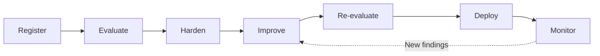

This guide takes an existing Agent from registration to a hardened, evidence-backed production release and ongoing monitoring. Use [Diamond](/concepts/platform/diamond) to evaluate the Agent, [Dome](/developer-guide/protect/overview) to protect it at runtime, and your delivery pipeline to release it. Follow the Console or [Python SDK](/developer-guide/sdk/setup) path at each stage.

<Info>
This workflow starts with registration and does not cover Discover or creating a new Agent through generative evolution. Automated Darwin adaptation is available only where enabled. The platform does not currently deploy your Agent application, so the final stage uses your existing delivery pipeline.
</Info>

## The Agent Trust Lifecycle



| Stage | Goal | Evidence Produced |
|---|---|---|
| **Register** | Connect the Agent to the platform | Active Agent and Agent ID |
| **Evaluate** | Measure trustworthiness and search for deeper weaknesses | [Trust Score](/concepts/trust-score/introduction), Trust Report, and Red Team findings |
| **Harden** | Add and test [runtime Guardrails](/developer-guide/protect/overview) | Applied Dome configuration and staging telemetry |
| **Improve** | Remediate weaknesses found during Evaluate | Reviewed Agent, Policy, and Guard changes |
| **Re-evaluate** | Confirm that the changes worked | Improved Evaluation results and release decision |
| **Deploy** | Release through your delivery pipeline | Production Agent reconnected to the platform |
| **Monitor** | Observe production behavior | [Dome Metrics](/owner-guide/protect-in-production/observability), events, logs, and traces |

The Console records **Registered**, **Tested**, and **Protected** [Agent stages](/owner-guide/register-agents/registering-agents#agent-stage). If you use [Darwin](/concepts/platform/darwin), accepting a proposal moves the Agent to the **Adapted** stage.

## Before You Begin

You need:

- A Console account and access to a team.
- An existing Agent with a reachable HTTP endpoint.
- Credentials and rate-limit information for the Agent endpoint.
- Permission to configure and deploy the Agent.
- Python 3.12 or later, the [SDK](/developer-guide/sdk/setup#installation), and the required [Dome extras](/developer-guide/protect/installation) for the SDK path.
- [Client credentials](/developer-guide/sdk/setup#authentication) for the SDK path.
- Optional [Policies](/owner-guide/simulate-environment/policies) and [Personas](/owner-guide/simulate-environment/personas) for targeted Evaluations and Red Team campaigns.

Define your release criteria before you begin. Decide:

- The Trust Score required for release.
- Findings that block release.
- Guardrail latency and error-rate limits.
- How you will assess false positives.
- Which reports or other evidence your reviewers need.

<Note>
The Console presents Trust Scores on a 0–100 scale. The SDK returns scores on a 0.0–1.0 scale. For example, a Console score of 70 is an SDK score of `0.70`.
</Note>

## 1. Register the Agent

Registration tells the platform how to reach the Agent and how much context it can use during testing. Choose the [access level](/owner-guide/register-agents/registering-agents#access-levels) that matches the information you can provide:

| Access Level | What You Provide | When to Use It |
|---|---|---|
| **Black Box** | Endpoint and credentials | You want to test observable behavior |
| **Grey Box** | Prompts, model configuration, tools, MCP servers, and delegated Agents | You want findings tied to the Agent composition |
| **White Box** | Agent configuration and source code | You want static and dynamic analysis |

<Tabs>
  <Tab title="Console">
    1. Open **Agents**.
    2. Select **+ Register Agent**.
    3. Enter the required Black Box fields.
    4. Add Grey Box or White Box context when available.
    5. Register the Agent and save its ID.
  </Tab>
  <Tab title="SDK">
    1. Create a `Vijil` client.
    2. Register the current Agent configuration with [`client.agents.create()`](/developer-guide/sdk/resources#client-agents).
    3. Save `agent.id` for the remaining stages.

    Use `client.agents.create()` for this workflow. Do not use [`client.register()`](/developer-guide/sdk/lifecycle-methods#preview-methods), which depends on a preview source-to-genome Console route.
  </Tab>
</Tabs>

### Checkpoint

- The Agent appears as **Active**.
- The Console can reach its endpoint.
- You saved the Agent ID.

If the Agent runs only on your workstation, follow [Evaluate a Local Agent](/developer-guide/evaluate/local-agent) before continuing.

## 2. Evaluate the Agent

A [Diamond Evaluation](/developer-guide/evaluate/overview) measures the Agent against known standards. Start with a baseline Trust Score Evaluation, then run adaptive Red Teaming to search for weaknesses that fixed tests might miss.

### Establish the Trust Baseline

<Tabs>
  <Tab title="Console">
    1. Open **Tests** and [create an Evaluation](/owner-guide/run-evaluations/running-evaluations#creating-an-evaluation).
    2. Select the registered Agent.
    3. Choose **Trust Score** and **Baseline**.
    4. Enable Reliability, Security, and Safety.
    5. Run the Evaluation.
  </Tab>
  <Tab title="SDK">
    1. Run [`client.evaluate(agent_id, baseline=True)`](/developer-guide/sdk/lifecycle-methods#client-evaluate).
    2. Record the Trust Score and the Reliability, Security, and Safety scores.
    3. Save the Evaluation ID.
  </Tab>
</Tabs>

Review the [Evaluation results](/developer-guide/evaluate/understanding-results):

- The Trust Score pass or fail result.
- The lowest-scoring Dimension.
- Critical and high-severity findings.
- Failure patterns and recommended fixes.
- Whether the Harness coverage matches the Agent's actual risks.

### Run an Adaptive Red Team Campaign

After the baseline Evaluation, run an [adaptive Red Team campaign](/owner-guide/run-evaluations/running-evaluations#running-a-red-team-campaign) against the registered Agent. Red Teaming investigates tool misuse, data leakage, policy violations, and weaknesses that fixed Evaluation cases might not expose.

<Tabs>
  <Tab title="Console">
    1. Create a new test for the Agent.
    2. Select the **Adaptive** Red Team configuration.
    3. Add relevant Policies and Personas.
    4. Start with conservative wave and concurrency settings.
    5. Run the campaign.
    6. Review the findings and successful attack strategies.
  </Tab>
  <Tab title="SDK">
    1. Use `client.xteam()` for the multi-wave seed, attack, judge, and reflect workflow.
    2. Poll until the campaign reaches a terminal state.
    3. Retrieve and review the findings.
  </Tab>
</Tabs>

Use [`client.test()`](/developer-guide/sdk/lifecycle-methods#client-test) only when the simpler campaign interface matches your deployment.

Use the [Red Team results](/owner-guide/run-evaluations/understanding-results#understanding-red-team-results) to inspect:

- `FULL`, `PARTIAL`, and `NONE` judgments.
- Confirmed policy violations.
- Leaked artifacts.
- Successful attack strategies.
- Which findings require runtime protection from Dome.
- Degraded or failed attacker runs.

### Checkpoint

- The baseline Evaluation completed successfully.
- You saved the [Trust Report](/developer-guide/evaluate/understanding-results#reading-the-trust-report).
- The adaptive Red Team campaign completed successfully.
- You saved its findings, transcripts, and successful strategies.
- You have a prioritized list of weaknesses.

## 3. Harden the Agent With Dome

Use the [Trust Score findings](/developer-guide/evaluate/understanding-results#reading-findings) and [Red Team evidence](/owner-guide/run-evaluations/understanding-results#understanding-red-team-results) to choose [Dome runtime protection](/developer-guide/protect/overview):

| Finding | Likely Protection |
|---|---|
| Prompt injection or jailbreak | Security input Guard |
| Sensitive-data leakage | Privacy output Guard |
| Harmful user requests | Moderation input Guard |
| Harmful Agent responses | Moderation output Guard |
| Agent-specific policy violation | Policy or custom Guard |

<Note>
Policy Guards are available through programmatic Dome. In the Console, create a custom Guard using one of the available Security, Moderation, or Privacy Guard types.
</Note>

Use the [Console Guardrail guide](/owner-guide/protect-in-production/configuring-guardrails) for UI details and the [Dome configuration reference](/developer-guide/protect/configuring-guardrails) for code-level options.

<Tabs>
  <Tab title="Console">
    1. Open the Agent and select **Protect**.
    2. Review the predefined input and output Guards.
    3. Enable or add the Detectors supported by the findings.
    4. Choose Serial or Parallel execution.
    5. Configure Early Exit.
    6. Test representative safe and unsafe inputs.
    7. Save and Apply the configuration.
    8. Send staging traffic through the Agent and confirm that Dome Metrics receives it.
  </Tab>
  <Tab title="SDK">
    1. Use [`client.protect()`](/developer-guide/sdk/lifecycle-methods#client-protect) to associate the Dome configuration with the Agent.
    2. Where enabled, [load the Guardrail configuration](/developer-guide/protect/overview#configuration-sources) with `Dome.create_from_vijil_agent()`. Otherwise, use a reviewed, version-controlled Dome configuration.
    3. [Wrap both Agent inputs and Agent outputs with Guardrails](/owner-guide/protect-in-production/deploying-dome#integration-pattern).
    4. Handle blocked and sanitized results explicitly.
    5. Send staging traffic through the hardened Agent and confirm that telemetry reaches the platform.
  </Tab>
</Tabs>

<Warning>
Saving a Dome configuration does not protect runtime traffic by itself. [Integrate Dome Guardrails into the Agent request path](/owner-guide/protect-in-production/deploying-dome#integration-pattern) before relying on the configuration.
</Warning>

<Note>
Hardening adds and validates runtime protection. It does not deploy the Agent application.
</Note>

### Checkpoint

- Known attacks trigger the expected Guards.
- Normal requests still work.
- Staging telemetry is available for the hardened Agent.
- The Agent reaches the **Protected** stage.

## 4. Improve the Agent

The platform provides Evaluation evidence and, where available, optional Darwin proposals. You are responsible for reviewing that evidence and applying remediation to the Agent.

Manual remediation is the default path. Depending on the finding, you might:

- Update the system prompt.
- Reduce tool permissions.
- Change the model or Agent configuration.
- Fix vulnerable code.
- Add or tune Dome Guards.
- Update Policies or Personas.
- Save representative successful attack inputs and transcripts as regression cases.

<Tabs>
  <Tab title="Console">
    1. Review the prioritized Trust Score and Red Team findings.
    2. Apply prompt, code, model, or tool-permission changes through your development workflow.
    3. Update the registered Agent configuration and Dome settings in the Console when needed.
    4. Record which finding each change addresses.
  </Tab>
  <Tab title="SDK">
    1. Apply code and configuration fixes through the application repository.
    2. Update the relevant Agent, Policy, or Dome configuration through the SDK when needed.
    3. Where Darwin is available, run [`client.adapt()`](/developer-guide/sdk/lifecycle-methods#client-adapt).
    4. Review the generated proposals with [`client.proposals`](/developer-guide/sdk/resources#client-proposals).
    5. Approve and apply only reviewed proposals.
    6. Preserve genome versions for comparison and audit.
  </Tab>
</Tabs>

<Info>
[Darwin](/concepts/platform/darwin) is in development and not yet generally available. If your deployment includes Darwin, review every generated proposal before applying it. Keep the manual remediation path complete when Darwin is unavailable.
</Info>

### Checkpoint

- Critical and high-risk findings have an owner.
- Successful attack transcripts are available as regression cases.
- Every important finding maps to a reviewed change or documented exception.
- If you used Darwin, you reviewed every automated proposal before applying it.
- The improved Agent is ready for another Evaluation.

## 5. Re-evaluate the Agent

Repeat the tests that cover the changed behavior:

- Run the complete baseline Evaluation.
- Run [targeted Harnesses](/developer-guide/evaluate/custom-harnesses) for the changed areas.
- Retest representative successful attacks through the Agent's regression test process.
- Run another adaptive campaign after changes to tools, prompts, permissions, or data access.
- [Compare the results](/developer-guide/evaluate/understanding-results#comparing-evaluations) with the original baseline.

<Tabs>
  <Tab title="Console">
    1. Create another baseline Trust Score Evaluation.
    2. Run targeted Harnesses for the changed areas.
    3. Manually retest representative attack inputs saved from the previous campaign.
    4. Compare the new Trust Score, Dimension scores, and findings with the baseline.
    5. Confirm that staging telemetry still reaches the correct Agent.
  </Tab>
  <Tab title="SDK">
    1. Run `client.evaluate(agent_id, baseline=True)`.
    2. After the baseline completes, use `client.evaluate(agent_id, harness_id="<harness-id>")` to run one targeted Harness. Repeat the call for each Harness you need.
    3. Retest saved attack inputs through the Agent's test suite.
    4. Use `client.xteam()` to start a new adaptive campaign with the relevant Policies and Personas.
    5. Compare the returned scores and findings with the saved baseline.
    6. Check staging traces with `client.monitor.traces()`.
  </Tab>
</Tabs>

A release gate should check that:

- The Trust Score meets your agreed threshold.
- No critical findings remain unresolved.
- High-severity exceptions have explicit approval.
- Targeted regression tests pass.
- Dome blocks known attacks.
- P99 latency and Guard error rates are acceptable.
- Telemetry works in the release environment.

### Checkpoint

- The release has reproducible Evaluation evidence.
- The Agent passes your deployment criteria.

## 6. Deploy Through Your Pipeline

Deploy the hardened Agent through your delivery pipeline of choice. The platform evaluates and protects the Agent, but it does not replace your application build, release, or infrastructure process.

### Gate Deployment in CI/CD

Run a final baseline Evaluation before your pipeline pushes the release to production. Store [`VIJIL_CLIENT_ID` and `VIJIL_CLIENT_SECRET`](/developer-guide/sdk/setup#authentication) and `VIJIL_AGENT_ID` as CI/CD secrets or protected variables.

```python
import os

from vijil import Vijil

agent_id = os.environ["VIJIL_AGENT_ID"]
threshold = float(os.getenv("VIJIL_TRUST_THRESHOLD", "0.70"))

client = Vijil()
evaluation = client.evaluate(agent_id, baseline=True)

successful_statuses = {"completed", "succeeded", "saved"}
if evaluation.status not in successful_statuses:
    raise SystemExit(f"Evaluation ended with status: {evaluation.status}")

if evaluation.trust_score is None:
    raise SystemExit("Evaluation returned no Trust Score")

if evaluation.trust_score < threshold:
    raise SystemExit(
        f"Trust Score {evaluation.trust_score:.2f} is below {threshold:.2f}"
    )

print(f"Trust Score gate passed: {evaluation.trust_score:.2f}")
```

Use `0.70` only as an example. Set `VIJIL_TRUST_THRESHOLD` to the threshold approved for your Agent and risk profile.

### Release and Reconnect the Agent

<Tabs>
  <Tab title="Console">
    1. Confirm that the latest Evaluation meets the release criteria.
    2. Deploy the hardened Agent through your delivery pipeline.
    3. If the endpoint or credentials changed, open **Agents**, [edit the registered Agent](/owner-guide/register-agents/registering-agents#manage-agents), and save the production configuration.
    4. Reapply the reviewed [Dome configuration](/owner-guide/protect-in-production/deploying-dome#configuration-sync).
    5. Run a production smoke test.
    6. Confirm that production traffic appears under the correct Agent.
  </Tab>
  <Tab title="SDK">
    1. Run the SDK release gate before the production deployment job.
    2. Deploy the hardened Agent through your delivery pipeline.
    3. If the endpoint or configuration changed, update the registered Agent with [`client.agents.update()`](/developer-guide/sdk/resources#client-agents).
    4. Reload or reapply the reviewed [Dome configuration](/owner-guide/protect-in-production/deploying-dome#configuration-sync).
    5. Run a production smoke test.
    6. Confirm that production traces use the expected Agent ID.
  </Tab>
</Tabs>

Your deployment artifact should:

1. Include [`vijil-dome` and the required extras](/developer-guide/protect/installation) in the deployment artifact.
2. Load the reviewed Dome configuration.
3. Keep credentials and other secrets outside source control.
4. Keep a rollback path for Agent and Guardrail changes.

### Checkpoint

- Production traffic passes through Dome.
- Blocking and fallback behavior work.
- The production Agent configuration points to the deployed endpoint.
- The release links to its Evaluation and Red Team evidence.

## 7. Monitor and Continue the Lifecycle

Use [Dome Metrics](/owner-guide/protect-in-production/observability) to investigate threats, tune protection, and catch behavior changes after deployment.

<Tabs>
  <Tab title="Console">
    1. Open the Agent and select **Monitor**.
    2. Review traffic, inbound and outbound blocks, errors, and P99 latency.
    3. Inspect Threat Breakdown, Guard Performance, Events, logs, and traces.
    4. Confirm that production traffic appears under the expected Agent.
  </Tab>
  <Tab title="SDK">
    1. Read production traces with `client.monitor.traces()`.
    2. Read production logs with `client.monitor.logs()`.

    Do not use `client.monitor.summary()` or historical `client.monitor.detections()` until their backend routes are available.
  </Tab>
</Tabs>

Use the telemetry to answer:

- Is a block a real threat or a false positive?
- Are output Guards preventing leakage?
- Are any Detectors failing?
- Is Guardrail latency acceptable?
- Has Agent behavior changed since the verified release?
- Is the telemetry complete enough for an investigation?

New findings restart the lifecycle at Improve. Apply a reviewed change, re-evaluate the Agent, pass the deployment gate, and release the update through the same pipeline.

### Checkpoint

- Production telemetry is available.
- Known attacks are visible and handled correctly.
- False positives, Guard errors, and latency remain within the approved limits.
- New findings have an owner and feed into the next improvement cycle.

## Production Readiness Checklist

- Register the Agent and verify that its endpoint is reachable.
- Complete the baseline Evaluation and review the Trust Report.
- Complete an adaptive Red Team campaign.
- Configure input and output Guards and integrate Dome into the Agent runtime.
- Confirm that staging telemetry reaches the correct Agent.
- Address critical and high-risk findings.
- Add successful attacks to regression testing.
- Re-evaluate the Agent and confirm that it meets the release criteria.
- Configure and pass the CI/CD Trust Score gate.
- Deploy the hardened Agent and update its registered production configuration.
- Verify production telemetry, Guardrail latency, and false-positive behavior.
- Assign monitoring and rollback owners.

## Troubleshooting

| Problem | What to Check |
|---|---|
| The Evaluation cannot reach the Agent | Review [Agent availability](/owner-guide/run-evaluations/running-evaluations#agent-availability), endpoint compatibility, credentials, and rate limits |
| The Evaluation takes too long | Review [Evaluation rate limits](/developer-guide/evaluate/overview#rate-limiting), use a small sample while iterating, then run full coverage before release |
| Red Team is too slow or expensive | Review [Red Team runtime and cost](/owner-guide/run-evaluations/running-evaluations#red-team-runtime-and-cost), then reduce waves, seeds, or parallel attackers |
| Dome blocks normal traffic | Inspect [Dome traces](/owner-guide/protect-in-production/observability#open-logs-and-traces) and tune the responsible Detector |
| The CI/CD gate fails | Check the Evaluation status, Trust Score, configured threshold, and [SDK credentials](/developer-guide/sdk/setup#authentication) |
| The platform uses the old Agent endpoint | [Update the registered Agent](/owner-guide/register-agents/registering-agents#manage-agents) after deployment |
| Dome Metrics is empty | Follow the [empty-state checks](/owner-guide/protect-in-production/observability#empty-states) for integration, traffic, Agent ID, and telemetry |
| Adaptation calls fail | Confirm [Darwin availability](/concepts/platform/darwin) for the deployment |

## Next Steps

<CardGroup cols={2}>
  <Card title="Manage Agents" icon="robot" href="/owner-guide/register-agents/registering-agents">
    Register Agents and choose an access level.
  </Card>
  <Card title="Run Evaluations" icon="play" href="/developer-guide/evaluate/running-evaluations">
    Start, monitor, and retrieve Diamond Evaluations.
  </Card>
  <Card title="Understand Results" icon="chart-bar" href="/developer-guide/evaluate/understanding-results">
    Interpret Trust Scores and rank findings.
  </Card>
  <Card title="Configure Guardrails" icon="sliders-horizontal" href="/developer-guide/protect/configuring-guardrails">
    Configure Guards, Detectors, and execution behavior.
  </Card>
  <Card title="Use Guardrails" icon="shield" href="/developer-guide/protect/using-guardrails">
    Integrate Dome into the Agent request path.
  </Card>
  <Card title="Observability" icon="eye" href="/developer-guide/protect/observability">
    Track Guardrail decisions, logs, and traces.
  </Card>
</CardGroup>
