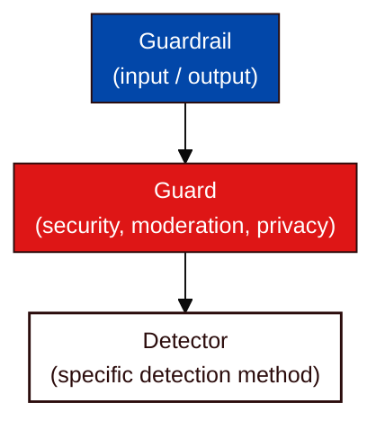

Dome's configuration system lets you precisely control which [Guards](/concepts/defense/guard) run, how they execute, and what [Detectors](/concepts/defense/detector) they use.

## Configuration Hierarchy

Dome organizes protection in three levels:



Each level has its own configuration options.

## Choose a Configuration Format

Dome accepts a Python dictionary, a path to a TOML file, or a prebuilt `DomeConfig` object. Install Dome first if you have not already, following [Install Dome](/developer-guide/protect/installation).

```python
from vijil_dome import Dome

config = {
    "input-guards": ["prompt-injection", "input-toxicity"],
    "output-guards": ["output-privacy"],
    "input-early-exit": False,
    "input-run-parallel": True,
    "input-blocked-message": "This request was blocked by policy.",
    "input-on-error": "fail_closed",
    "prompt-injection": {
        "type": "security",
        "methods": ["prompt-injection-deberta-v3-base", "encoding-heuristics"],
        "prompt-injection-deberta-v3-base": {"threshold": 0.8},
    },
    "input-toxicity": {
        "type": "moderation",
        "methods": ["moderation-flashtext"],
    },
    "output-privacy": {
        "type": "privacy",
        "methods": ["privacy-presidio"],
        "privacy-presidio": {"anonymize": True},
    },
}

dome = Dome(config)
```

The same configuration as TOML:

```toml
[guardrail]
input-guards = ["prompt-injection", "input-toxicity"]
output-guards = ["output-privacy"]
input-early-exit = false
input-run-parallel = true
input-blocked-message = "This request was blocked by policy."
input-on-error = "fail_closed"

[prompt-injection]
type = "security"
methods = ["prompt-injection-deberta-v3-base", "encoding-heuristics"]

[prompt-injection.prompt-injection-deberta-v3-base]
threshold = 0.8

[input-toxicity]
type = "moderation"
methods = ["moderation-flashtext"]

[output-privacy]
type = "privacy"
methods = ["privacy-presidio"]

[output-privacy.privacy-presidio]
anonymize = true
```

Load a TOML configuration by passing its path:

```python
dome = Dome("./config/dome.toml")
```

<Note>
Every name in the input and output Guard lists must match a Guard table in the same configuration. You can also inline a Guard definition as a dictionary inside the list instead of naming it.
</Note>

## Guardrail Options

A [Guardrail](/concepts/defense/guardrail) is the input or output pipeline that holds your Guards. Its keys are prefixed with `input-` or `output-`:

| Option | Type | Default | Description |
|--------|------|---------|-------------|
| `input-guards` | List | `[]` | Guards to run on input |
| `output-guards` | List | `[]` | Guards to run on output |
| `input-early-exit` | Boolean | `true` | Stop on the first input Guard that flags |
| `output-early-exit` | Boolean | `true` | Stop on the first output Guard that flags |
| `input-run-parallel` | Boolean | `false` | Run input Guards concurrently |
| `output-run-parallel` | Boolean | `false` | Run output Guards concurrently |
| `input-blocked-message` | String | Built-in message | Response returned when an input Guard blocks |
| `output-blocked-message` | String | Built-in message | Response returned when an output Guard blocks |
| `input-on-error` | String | Mode-dependent | `fail_open` or `fail_closed` for input Detector errors |
| `output-on-error` | String | Mode-dependent | `fail_open` or `fail_closed` for output Detector errors |

You can also record identity metadata in the configuration. Dome attaches these values to scans and telemetry:

| Option | Description |
|--------|-------------|
| `agent_id` | Registered Agent identifier, also accepted as `agent_config_id` |
| `team_id` | Team identifier |
| `user_id` | User identifier |

### Execution Modes

- **Early exit** <Badge>DEFAULT</Badge>: stops processing when the first Guard flags content. Faster for rejecting clearly malicious input.
- **Complete execution**: set `early-exit` to `false` to run every Guard regardless of flags. Useful for comprehensive logging.
- **Parallel execution**: set `run-parallel` to `true` to run Guards concurrently and reduce scan latency. Combined with early exit, Dome cancels pending checks once one flags.

## Guard Options

| Option | Type | Default | Description |
|--------|------|---------|-------------|
| `type` | String | Required | Guard category |
| `methods` | List | Required | Detectors this Guard runs |
| `early-exit` | Boolean | `true` | Stop on the first Detector that flags |
| `run-parallel` | Boolean | `false` | Run Detectors concurrently |
| `on-error` | String | Inherited | `fail_open` or `fail_closed` for this Guard |

A Guard-level `on-error` overrides the value inherited from its Guardrail.

### Guard Types

A Guard can only use Detectors registered under its own category:

| Type | Use Case | Representative Detectors |
|------|----------|--------------------------|
| `security` | Prompt injection, jailbreaks, obfuscated payloads | `prompt-injection-mbert`, `encoding-heuristics` |
| `moderation` | Harmful content and keyword lists | `moderation-deberta`, `moderation-flashtext` |
| `privacy` | PII and credentials | `privacy-presidio`, `detect-secrets` |
| `integrity` | Hallucination and factual consistency | `hhem-hallucination`, `fact-check-roberta` |
| `generic` | Configurable LLM classifier | `generic-llm` |
| `policy` | Content checks against written policy | `policy-sections`, `policy-gpt-oss-safeguard` |

## Detector Options


| Option | Description |
|--------|-------------|
| `route` | `auto`, `local`, or `remote`. Controls whether a remote-capable Detector runs locally or on the inference service at `DOME_INFERENCE_URL` |
| `method` | Underlying detection method name. Set this to run the same Detector twice with different options under different table names |
| `max_batch_concurrency` | Maximum concurrent calls this Detector makes during batch scans. Defaults to `5` |

```toml
[prompt-injection]
type = "security"
methods = ["strict-injection", "lenient-injection"]

[prompt-injection.strict-injection]
method = "prompt-injection-mbert"
threshold = 0.5
route = "remote"

[prompt-injection.lenient-injection]
method = "prompt-injection-mbert"
threshold = 0.9
route = "local"
```

<Info>
See [Detection Methods](/developer-guide/protect/detection-methods) for every built-in Detector, its parameters, and its routing behavior.
</Info>

## Enforcement and Failure Behavior

`Dome(enforce=True)` is the default. Set `enforce=False` for shadow mode, where Dome reports flagged content without marking it for enforcement:

```python
dome = Dome(config, enforce=False)
```

The enforcement mode also sets the default error policy when the configuration omits `on-error`:

| Mode | Default `on-error` | Behavior on a Detector error |
|------|--------------------|------------------------------|
| `enforce=True` | `fail_closed` | An unreachable or failing Detector blocks the content |
| `enforce=False` | `fail_open` | A failing Detector allows the content through |

An explicit `on-error` value in the configuration always wins over the mode default. Failed Detectors remain listed in `ScanResult.errored_methods`.

## Load a Configuration From Another Source

| Source | Constructor |
|--------|-------------|
| Built-in defaults | `Dome()` |
| Dictionary or TOML path | `Dome(config)` or `Dome.create_from_config(config)` |
| Registered [Agent](/owner-guide/register-agents/what-is-an-agent) [configured in the Console](/owner-guide/protect-in-production/configuring-guardrails) | `Dome.create_from_vijil_agent()` |
| Evaluation recommendation | `Dome.create_from_vijil_evaluation()` |
| S3 object, with the `s3` extra | `Dome.create_from_s3()` |

To inspect or modify the defaults before use, build the configuration explicitly:

```python
from vijil_dome import Dome, create_dome_config, get_default_config

default_config = get_default_config()
dome_config = create_dome_config(default_config)
dome = Dome(dome_config)
```


<Card title="Work in Progress" icon="pickaxe" badge="Private preview">
  The programmatic protection capabilities and Dome integrations are currently in private preview and subject to change.
</Card>

## Next Steps

<CardGroup cols={2}>
  <Card title="Use Guardrails" icon="train-track" href="/developer-guide/protect/using-guardrails">
    Runtime integration patterns
  </Card>
  <Card title="Detection Methods" icon="radar" href="/developer-guide/protect/detection-methods">
    Every built-in Detector and its parameters
  </Card>
  <Card title="Custom Detectors" icon="wrench" href="/developer-guide/protect/custom-detectors">
    Build your own Detectors
  </Card>
  <Card title="Observability" icon="eye" href="/developer-guide/protect/observability">
    Monitoring and tracing
  </Card>
</CardGroup>
