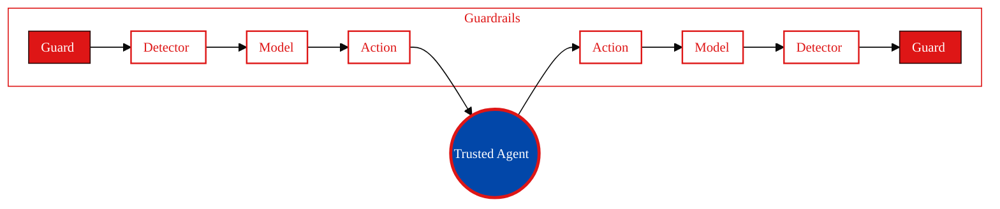

<Tip>
**TL;DR:** Dome wraps your [Agent](/owner-guide/register-agents/what-is-an-agent) with configurable [Guardrails](/concepts/defense/guardrail) that intercept every input and output, blocking attacks before they reach your agent or your users. Configure which [Guards](/concepts/defense/guard) run via your registered Vijil Agent, a TOML file, or a Python dict, then choose early-exit (fast) or parallel execution (thorough) mode.
</Tip>

Evaluation catches vulnerabilities you know to test for. But attackers will try things you did not anticipate like new prompt injection techniques, novel encoding tricks, social engineering patterns that emerge after your last evaluation.

Dome is Vijil's runtime protection system. It intercepts every input and output, applies configurable Guardrails, and blocks attacks before they reach your agent or your users. When Diamond identifies vulnerabilities you cannot immediately fix, Dome provides defense-in-depth while you remediate.

## How Dome Works

Dome wraps your agent with configurable Guardrails:

| Component | Purpose |
|-----------|---------|
| **[Guardrail](/concepts/defense/guardrail)** | Pipeline of Guards (input or output) |
| **[Guard](/concepts/defense/guard)** | Group of Detectors of one type |
| **[Detector](/concepts/defense/detector)** | Individual detection method |

## Protection Types

### Security Guards

Detect and block adversarial attacks:

| Detector | What It Catches |
|----------|-----------------|
| `prompt-injection-mbert` | Injected instructions in user input |
| `prompt-injection-deberta-v3-base` | Advanced injection attempts |
| `encoding-heuristics` | Base64, Unicode, and encoding attacks |
| `security-embeddings` | Semantic similarity to known attacks |

### Moderation Guards

Filter harmful and inappropriate content:

| Detector | What It Catches |
|----------|-----------------|
| `moderation-flashtext` | Fast keyword-based toxicity |
| `moderation-deberta` | Neural toxicity classification |
| `moderations-oai-api` | OpenAI Moderation API |
| `moderation-llamaguard` | Llama Guard safety model |

### Privacy Guards

Prevent exposure of sensitive data:

| Detector | What It Catches |
|----------|-----------------|
| `privacy-presidio` | PII (names, emails, SSN, etc.) |
| `detect-secrets` | API keys, passwords, credentials |

## Quick Start

You can protect your agents with default Guards. The default configuration includes:
- **Input**: Prompt injection detection, encoding heuristics, moderation
- **Output**: Moderation, PII detection

## Configuration Sources

Dome accepts configuration from three sources:

| Source | How to Use | Best For |
|--------|-----------|----------|
| **Registered Agent** | Pull from your Vijil Console agent definition | Production: keeps configuration in sync with your policy |
| **TOML file** | Reference a local `.toml` file at initialization | Version-controlled configuration in CI/CD |
| **Python dict** | Pass a `dict` at runtime | Dynamic configuration, testing, prototyping |

For the full list of configuration options, see [Configure Guardrails](/developer-guide/protect/configuring-guardrails).

## Scan Results

Every scan returns a result object with the following fields:

| Field | Type | Description |
|-------|------|-------------|
| `is_safe` | Boolean | `True` if content passed all Guards |
| `flagged` | Boolean | `True` if any Guard flagged the content |
| `response_string` | String | Original content if safe; fallback message if blocked |
| `exec_time` | Float | Scan duration in milliseconds |
| `trace` | Dict | Per-Guard and per-Detector execution details |

## Framework Integrations

Dome is designed to be integrable with popular frameworks and runtimes. You can see the specific framework developer guides for integration patterns during the developer access phase.

## Performance Options

| Mode | Behavior | Best For |
|------|----------|----------|
| **Early exit** (default) | Stops after the first Guard flags content | Rejecting clearly malicious input with minimal latency |
| **Complete execution** | Runs all Guards regardless of flags | Comprehensive audit trails, maximum detection coverage |
| **Parallel execution** | Runs Guards concurrently | High-throughput production environments |

See [Configure Guardrails](/developer-guide/protect/configuring-guardrails) for the configuration options for each mode.

<Card title="Work in Progress" icon="pickaxe" badge="Private preview">
  The programmatic protection capabilities are currently in private preview and subject to change.
</Card>

## Next Steps

<CardGroup cols={2}>
  <Card title="Configure Guardrails" icon="sliders-horizontal" href="/developer-guide/protect/configuring-guardrails">
    Detailed Guard configuration options
  </Card>
  <Card title="Use Guardrails" icon="train-track" href="/developer-guide/protect/using-guardrails">
    Runtime patterns and best practices
  </Card>
  <Card title="Custom Detectors" icon="wrench" href="/developer-guide/protect/custom-detectors">
    Build your own detection methods
  </Card>
  <Card title="Observability" icon="eye" href="/developer-guide/protect/observability">
    Monitoring and tracing setup
  </Card>
</CardGroup>
