<Tip>
**TL;DR:** Dome scans [Agent](/owner-guide/register-agents/what-is-an-agent) inputs and outputs with configurable Guardrails. Call `Dome` directly or use an integration to apply the resulting decision. Dome marks flagged content for enforcement in enforce mode, while shadow mode reports detected violations without marking them for enforcement.
</Tip>

Evaluation catches vulnerabilities you know to test for. Attackers will also try techniques you did not expect, such as new prompt injections, encoding tricks, and social engineering patterns that emerge after your last evaluation.

Dome protects Agents at runtime. Its content Guardrails scan data before and after Agent execution. Direct `Dome` calls return a `ScanResult`; your application or framework integration decides how to apply the result, such as stopping execution or returning blocked or sanitized content.

For tool-using Agents, [Trust Runtime](/developer-guide/protect/trust-runtime) adds trust controls when you configure them. These controls include SPIFFE workload identity, Console or local constraints, tool-level mandatory access control, signed tool manifest support, tool attestation, structured audit events, and optional enforcement heartbeats. Use `secure_agent()` with LangGraph, Google ADK, or Strands, or use `TrustRuntime` directly for a custom integration.

## Choose a Protection Interface

| Interface | Use It When | Protection |
|-----------|-------------|------------|
| `Dome` | You need to scan Agent inputs and outputs | Content Guardrails |
| `secure_agent()` | You use LangGraph, Google ADK, or Strands | Content Guardrails plus configured identity, framework-dependent tool access control, attestation, and audit events |
| `TrustRuntime` | You need direct control or a custom integration | Individual methods for each configured trust enforcement point |

## How Dome Works

A Guardrail contains one or more Guards, and each Guard invokes one or more Detectors. Input and output Guardrails run on opposite sides of Agent execution:

```mermaid actions={false}
%%{init: {'theme':'base', 'themeVariables': {'fontFamily':'Futura Medium, Futura, sans-serif','fontSize':'13px'}, 'flowchart': {'nodeSpacing':25,'rankSpacing':40,'padding':6}}}%%
flowchart LR
    Request[Request] --> InputGuard

    subgraph InputGuardrail[Input Guardrail]
        direction LR
        InputGuard[Guard] --> InputDetector[Detector]
    end

    InputDetector --> Agent((Agent))
    Agent --> OutputGuard

    subgraph OutputGuardrail[Output Guardrail]
        direction LR
        OutputGuard[Guard] --> OutputDetector[Detector]
    end

    OutputDetector --> Response[Response]

    classDef endpoint fill:#FFFFFF,stroke:#2B0C0C,color:#2B0C0C,stroke-width:1.5px;
    classDef guard fill:#DE1616,stroke:#2B0C0C,color:#FFFFFF,stroke-width:1px;
    classDef detector fill:#FFFFFF,stroke:#DE1616,color:#DE1616,stroke-width:1.5px;
    classDef agent fill:#0247A9,stroke:#2B0C0C,color:#FFFFFF,stroke-width:1.5px;
    classDef railbox fill:none,stroke:#DE1616,color:#DE1616,stroke-width:1px;

    class Request,Response endpoint;
    class InputGuard,OutputGuard guard;
    class InputDetector,OutputDetector detector;
    class Agent agent;
    class InputGuardrail,OutputGuardrail railbox;
```

| Component | Purpose |
|-----------|---------|
| **[Guardrail](/concepts/defense/guardrail)** | Input or output pipeline containing Guards |
| **[Guard](/concepts/defense/guard)** | Group of Detectors for one protection category |
| **[Detector](/concepts/defense/detector)** | Individual detection method |

## Protection Types

Dome supports six Guard categories. The following table shows representative registered Detectors rather than the complete catalog:

| Guard Category | Purpose | Representative Detectors |
|----------------|---------|--------------------------|
| **Security** | Detect prompt injection, jailbreaks, and obfuscated payloads | `prompt-injection-mbert`, `encoding-heuristics` |
| **Moderation** | Detect harmful content and match configured keyword lists | `moderation-deberta`, `moderation-flashtext` |
| **Privacy** | Detect PII and credentials | `privacy-presidio`, `detect-secrets` |
| **Integrity** | Check factual consistency and hallucinations | `hhem-hallucination`, `fact-check-roberta` |
| **Generic** | Apply a configurable LLM classifier | `generic-llm` |
| **Policy** | Check content against configured policy sections | `policy-sections` |

<Info>
See [Detection Methods](/developer-guide/protect/detection-methods) for the full Detector catalog and configuration parameters.
</Info>

## Default Guardrails

`Dome()` creates input and output Guardrails with the following default checks:

| Direction | Default Checks |
|-----------|----------------|
| **Input** | Encoding heuristics, prompt injection detection, moderation |
| **Output** | Moderation, PII detection |

The default prompt injection and moderation models require the `local` extra when you run them locally, and Presidio PII detection requires the `pii` extra. You can instead set `DOME_INFERENCE_URL` to route supported Detectors, including the default model and PII Detectors, to an inference service.

## Configuration Sources

Choose a configuration source that matches how you operate Dome:

| Source | How to Use | Best For |
|--------|------------|----------|
| **Built-in defaults** | Initialize `Dome()` without a configuration | Initial setup and evaluation |
| **Local configuration** | Pass a Python dictionary or TOML path to `Dome` | Version-controlled or dynamic configuration |
| **Registered Agent** | Use `Dome.create_from_vijil_agent()` | Console-managed Agent configuration |
| **Evaluation recommendation** | Use `Dome.create_from_vijil_evaluation()` | Guardrails derived from evaluation results |
| **S3** | Use `Dome.create_from_s3()` with the `s3` extra | Remotely managed configuration in AWS |

<Info>
For the available settings, see [Configure Guardrails](/developer-guide/protect/configuring-guardrails).
</Info>

## Scan Results

Every input or output scan returns a `ScanResult` with these key members:

| Member | Type | Description |
|--------|------|-------------|
| `flagged` | `bool` | Whether any Guard flagged the content |
| `enforced` | `bool` | Whether Dome marks a flagged result for enforcement |
| `response_string` | `str` | Original, blocked, or sanitized content returned by the Guardrail |
| `detection_score` | `float` | Highest triggered detection score, clamped between `0.0` and `1.0` |
| `triggered_methods` | `list[str]` | Detectors that flagged the content |
| `errored_methods` | `list[str]` | Detectors or Guard tasks that returned errors or timed out |
| `trace` | `dict` | Per-Guard and per-Detector execution details |
| `exec_time` | `float` | Total scan duration in seconds |
| `is_safe()` | Method returning `bool` | Returns `True` when `flagged` is `False`, regardless of enforcement mode |

## Framework Integrations

You can call `Dome.guard_input()` and `Dome.guard_output()` from any Agent framework. For the complete trust stack, `secure_agent()` provides built-in adapters for LangGraph, Google ADK, and Strands.

Tool enforcement depends on the integration points exposed by each framework. LangGraph tool access control is best-effort because the compiled graph must expose tool functions that the adapter can discover and wrap. LangGraph checks streaming output only after it yields the chunks, so an output Guard cannot retract delivered chunks.

<Info>
See [Trust Runtime](/developer-guide/protect/trust-runtime) for integration examples and constraints.
</Info>

## Execution and Failure Options

Early exit and parallel execution are independent options at both the Guardrail and Guard levels:

| Option | Behavior |
|--------|----------|
| **Early exit** | Stops after the first configured Guard or Detector flags content |
| **Parallel execution** | Runs configured Guards or Detectors concurrently and can reduce scan wall-clock latency |

By default, Guards and Guardrails use early exit and do not use parallel execution. Disable early exit to run every configured check. You can also combine early exit with parallel execution; Dome cancels pending checks after one flags content.

When configuration omits `on-error` settings, `Dome(enforce=True)` defaults to `fail_closed`, while `Dome(enforce=False)` defaults to `fail_open`. Explicit Guardrail-level or Guard-level `on-error` values override the inherited default. Failed methods remain available in `errored_methods` for inspection.

<Info>
See [Configure Guardrails](/developer-guide/protect/configuring-guardrails) for the settings at each level.
</Info>

## Next Steps

<CardGroup cols={2}>
  <Card title="Trust Runtime" icon="shield-check" href="/developer-guide/protect/trust-runtime">
    Add identity, tool access control, attestation, and audit events
  </Card>
  <Card title="Configure Guardrails" icon="sliders-horizontal" href="/developer-guide/protect/configuring-guardrails">
    Configure Guards, Detectors, execution, and failure behavior
  </Card>
  <Card title="Use Guardrails" icon="train-track" href="/developer-guide/protect/using-guardrails">
    Apply Guardrails at runtime
  </Card>
  <Card title="Detection Methods" icon="radar" href="/developer-guide/protect/detection-methods">
    Review built-in Detectors and their parameters
  </Card>
  <Card title="Custom Detectors" icon="wrench" href="/developer-guide/protect/custom-detectors">
    Build your own detection methods
  </Card>
  <Card title="Observability" icon="eye" href="/developer-guide/protect/observability">
    Track Guardrail decisions and traces
  </Card>
</CardGroup>
