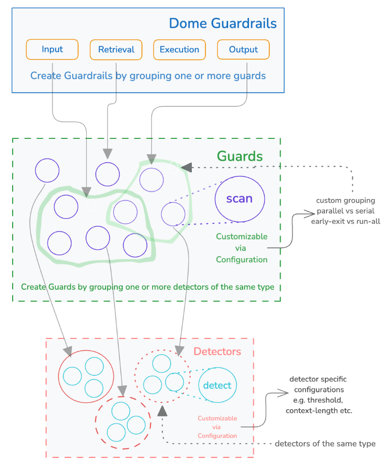

# Overview

This section introduces Dome, explaining its core concepts and functionality, including Guardrails, Guards, and Detectors.

## Guardrails

Vijil Dome allows users to assemble and configure Guardrails, which are designed to scan data exchanged with LLMs, knowledge bases, or other agents. Dome supports several types of Guardrails:

- **Input Guardrails**: For scanning inputs to a foundation model.
- **Output Guardrails**: For scanning outputs from a foundation model.
- **Retrieval Guardrails** (coming soon): To protect requests to and from retrievers.
- **Execution Guardrails** (coming soon): To protect requests to and from external agents and tools.


Guardrails consist of a set of **Guards** and how they should be executed. These guards are fully configurable and customizable.

### Guards

Guards are the building blocks of Guardrails. Each Guard performs specific checks and/or transformations on the data. For instance, a guard in an input guardrail can check for security, while a guard in an output guardrail might check for moderation or privacy. 

A guard belongs to one of the following categories:
- Security
- Moderation
- Privacy
- Integrity

Guards consist of a set of **Detectors** and how they should be executed.

### Detectors

Detectors are the components within Guards that perform the actual detection of issues. Each Guard can include multiple Detectors, each responsible for identifying specific types of risks or violations.

### Setting Up Guards and Detectors

Users can configure Guards by selecting and combining different Detectors based on their specific needs. This customization allows for flexible and robust Guardrails that cater to diverse application requirements.



#### Example Configuration

Here is an example of how you can set up Guards and Detectors (see the [Configuring Dome section](config) for more details):

```python
 
 config = {
    ########################
    # setup guardrails from guards
    ########################
    # input guardrail
    "input-guards": ["prompt-injection", "input-privacy"],
    
    # output guardrail
    "output-guards": ["output-toxicity"],
    
    ##########################
    # assemble and configure guards 
    ##########################
    
    # a guard for prompt injection
    "prompt-injection": {
        "type": "security",
        "methods" : ["prompt-injection-deberta-v3-base", "security-llm"],
    },
    
    # a guard to remove PII from requests to the LLM
    "input-privacy": {
        "type": "privacy",
        "methods": ["privacy-presidio"]
    },
    
    # a guard for toxic output content 
    "output-toxicity": {
        "type": "moderation",
        "methods": ["moderation-llamaguard"]
    },
}
```

### Scan Results

The output from Dome's `scan` functions is a `ScanResult` object. It contains the following fields
- `flagged`: boolean value that indicates if the guardrail has flagged the data that was passed through it. If this is true, it means the input is in violation of the policy the guardrail aims to enforce. This value will always be the opposite of the value returned from the ScanResult's `.is_safe()` method.
- `response_string`: a string that contains the guardrail's response message. This can be the original input if there was nothing wrong with it, a sanitized version of the input, or a message indicating that the input was blocked, along with the methods that blocked it. 
- `exec_time`: float. the time it took for the guardrail to scan the input, measured in milliseconds
- `trace`: a dictionary. This contains the execution information for every guard in the guardrail. This includes whether or not they were flagged, their individual execution times, and debugging information for each detector in the guard. 

